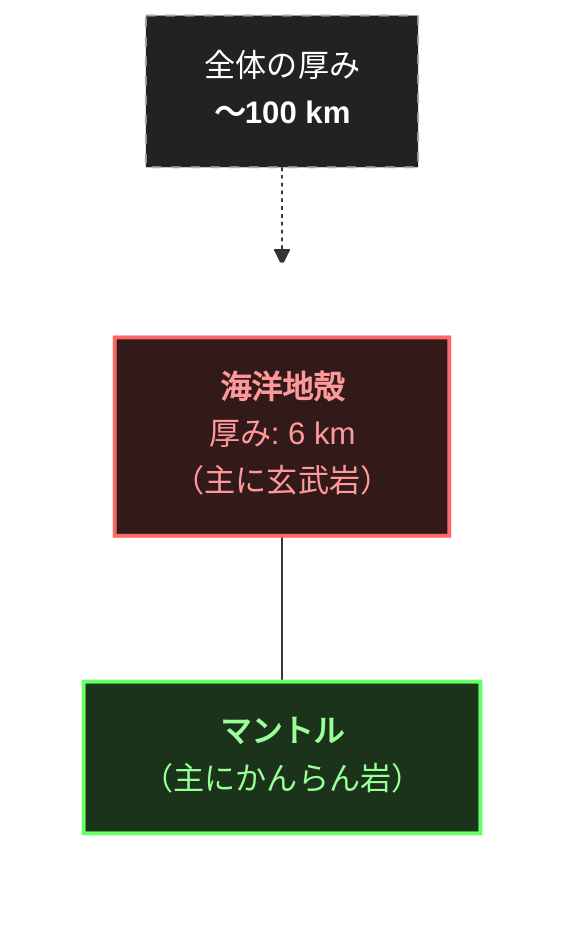
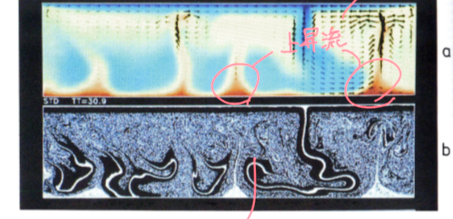
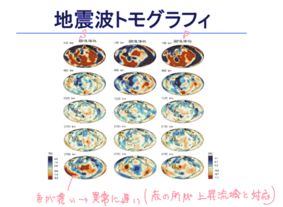

# 地球惑星内部物質科学（Hirose part）(作成中)

---

<!-- 第2回まで完了 -->
<!-- BORB.png, seismography.png を持っていくこと -->
<!--  第2回の写しだけはやった-->
<!-- indexを更新すること -->

---

# 第1回：地球と惑星の内部物理

## 1.1 結晶構造転移
地球内部の物質に高い圧力が加わると、原子の配列が変わる「結晶構造転移（相転移）」が起こります。結晶構造転移によって生じる高圧相の物質は、必ず次のような共通の性質を持ちます。

1. **密度の増加**（体積の減少）：$$\text{密度 } \uparrow (\text{体積 } \downarrow)$$
2. **硬さの増加**（体積弾性率の増加）による、**圧縮されにくさ**の向上：$$\text{体積弾性率 } \uparrow \; \rightarrow \text{ 圧縮されにくい}$$

この結晶構造転移（高圧相への変化）が起こることで、マントル中を伝わる地震波速度に明瞭な変化（不連続面）が生じます。

地球内部の深さに応じて、主要な構成成分であるケイ素（$\text{Si}$）の配位数は以下のように変化します。
* **地殻 ＋ 上部マントル**：$\text{Si}$が4配位を取り、$\text{SiO}_4$四面体が構造の基本単位となります。
* **下部マントル**：$\text{Si}$が6配位を取り、$\text{SiO}_6$八面体が構造の基本単位となります。

上部マントルから下部マントルへと移行する境界（深さ ＝ 660 km）では、以下のような物理的変化が特徴として見られます。
* 物質の粘性が非常に大きくなる。
* 粘性の上昇が起こる（物質が硬くなり、変形しにくくなる）。

> [!tip] わかりやすい解説
> 地球の地下深くにいくほど、上にある岩石の重み（自重）によって圧倒的な圧力がかかります。物質は、その凄まじい圧力に耐えるために、原子同士の隙間を詰めて少しでもコンパクトになろうとします。これが「結晶構造転移」です。
> $\text{Si}$（ケイ素）の周りに4つの酸素が結びついていた構造（$\text{SiO}_4$四面体）が、深さ660kmに達すると、さらにギューギューに押し潰されて6つの酸素が結びつく構造（$\text{SiO}_6$八面体）へと変化します。
> 物質は「密度が高く、硬いものほど地震波が速く伝わる」という性質があるため、この660kmの境界を境に、マントルを伝わる地震波のスピードが急激に跳ね上がります。これが、地震波速度の変化として観測される仕組みです。また、ここで物質が硬く変形しにくくなる（粘性が上がる）ため、地球内部の物質の対流（マントル対流）の動きにもブレーキがかかる重要な境界線となっています。

---

## 1.2 金属転移
物質は、加えられる圧力が大きくなるにつれて、電気的な性質が以下のように変化していきます。
$$\text{絶縁体} \rightarrow \text{半導体} \rightarrow \text{金属}$$

* ほとんどすべての物質は、極限まで圧力をかけていくと最終的に「金属」になります。この性質から、巨大な惑星の内部は金属状態の物質でできていると考えられています。
* 例えば、地球の地殻に大量に含まれる $\text{SiO}_2$（石英）も、約600万気圧という超高圧下では金属へと転移します。
* ※高圧物理における単位の目安：$$1 \text{ GPa (ギガパスカル)} ＝ 1\text{万気圧}$$

金属と半導体では、温度（$T$）が上昇したときの電気抵抗（$R$）の挙動（温度依存性）が真逆になります。

* **金属**：高温になると、物質を構成する原子の振動（熱振動）が大きくなり、電気を運ぶ自由電子の流れを妨害します。そのため、温度が上がると抵抗が上がります。
  $$\frac{\partial R}{\partial T} > 0$$
* **半導体**：高温になると、熱エネルギーによって電子が動きやすくなり、電気の流れが良くなります。そのため、温度が上がると抵抗が下がります。
  $$\frac{\partial R}{\partial T} < 0$$

> [!tip] わかりやすい解説
> 「圧力をかけると石ころが金属になる」というのは不思議に思えるかもしれませんが、原子同士を限界まで押し潰すと、普段はそれぞれの原子に縛られていた電子が、隣の原子の電子の通り道と重なり合ってしまいます。その結果、電子がどこへでも自由に動けるようになり（自由電子化）、電気をよく通す「金属」へと変身します。
> ここで出てくる数式 $\frac{\partial R}{\partial T}$ は、「温度（$T$）が変わったときに、電気抵抗（$R$）がどう変化するか」を表しています。
> 金属は、温度が上がると原子がブルブルと激しく震えて電子の通り道を邪魔するため、抵抗が増えます（変化率がプラス $> 0$）。一方、半導体は、普段は電子が特定の場所に捕まっていますが、温度が上がると熱のエネルギーをもらって元気に飛び回るようになるため、むしろ電気が流れやすくなり、抵抗が減ります（変化率がマイナス $< 0$）。この違いを調べることで、惑星の奥深くにある物質が現在どのような状態にあるかを突き止めることができます。

---

## 1.3 ガス惑星内部における水素の金属化とヘリウムの不混和
木星や土星などのガス惑星の内部では、超高圧環境によって水素が金属化し、**液体金属水素**の状態で存在しています。

$$
\begin{array}{c}
\text{ガス惑星内部での水素の金属化（液体金属水素）} \\
\updownarrow \\
\text{固体金属水素（超伝導）} \cdots \text{大気圧下に回収可能？}
\end{array}
$$

さらに、超高圧下で安定する可能性がある「固体金属水素」は、電気抵抗がゼロになる**超伝導**の性質を持つと予想されており、これを「大気圧下に回収可能か（地球の表面に無傷で持って帰ってこられるか）」という点が、現代科学の大きな関心事・研究テーマとなっています。

巨大ガス惑星の内部では、水素の金属化に伴い以下のような現象が発生します。
* ガス惑星の内部で液体水素が金属化すると、元々混ざり合っていた**ヘリウム（$\text{He}$）が「液体不混和」を起こします**（水と油のように、互いに混ざり合わずに分離する状態）。
* 分離したヘリウムは水素よりも密度が重いため、惑星の中心に向かって **“ヘリウムの雨（Heの雨）”** として下に降り注ぎます。
* このヘリウムの沈降（位置エネルギーの解放）は、**ガス惑星内部の重要な熱源**となっています。

> [!tip] わかりやすい解説
> 木星や土星は「ガス惑星」と呼ばれますが、それは表面だけの話で、中心に向かうにつれて物凄い圧力でガスが圧縮されています。宇宙で一番軽い気体である水素ですら、中心部ではあまりの圧力に押し潰され、電気をバリバリ通す「液体金属水素」という特殊なプールのような状態になっています。
> そして、水素が金属の液体に変わると、それまで仲良く混ざっていたヘリウムが、まるで「水と油」のように弾き出されて分離してしまいます（液体不混和）。ヘリウムのほうが水素より重いため、この分離したヘリウムが惑星の奥深くへと「雨」のようにしとしとと落ちていきます。
> 重いものが下に落ちると、重力のエネルギーが熱へと変わります。実は木星や土星は、太陽から受ける熱量よりも、自ら宇宙に放り出している熱量のほうが多いのですが、その隠されたエネルギー源（ストーブ）の正体が、この惑星内部で降り続いている「ヘリウムの雨」なのです。

---

## 1.4 氷惑星内部の水とその状態変化
天王星や海王星などの「氷惑星」の内部にある水は、冷たい氷ではなく、高圧によって生じた**「$\text{H}_2\text{O}$ の水（液体）」が主体**となっています。

この過酷な惑星内部環境において、水（$\text{H}_2\text{O}$）は圧力の上昇に伴い、**分子性 → イオン性 → 電子伝導性** という3つの相（性質）に変化していきます。

* **分子性**：分子の形（$\text{H}_2\text{O}$）を保っており、ほとんどイオンになっていない、電気を通さない「絶縁体」の状態。
* **イオン性**：約10万気圧以上の環境で、水の分子が壊れ、ほとんどが「イオン」として存在する状態。
* **電子伝導性**：さらに圧倒的な高圧になり、電子が自由に動き回る状態（金属と同じように電気を非常に流しやすい性質）。

> [!tip] わかりやすい解説
> 天王星や海王星は「氷惑星」に分類されますが、その中心にあるのは私たちが知っている冷たい氷の塊ではなく、数千度・数十万気圧という、超高温・超高圧の「ドロドロした水（流体）」の巨大な海です。
> この特殊な環境下の水は、圧力が強くなるにつれて姿を変えます。初期段階の【分子性】では普通の水分子ですが、10万気圧を超えて【イオン性】になると、水分子の結合がバラバラになり、水素イオン（プロトン）が水中を自由に高速で動き回る「超イオン水」という特殊な状態になります。この状態ではイオンが動くことで電気が流れます。さらに惑星の最深部に近づいて【電子伝導性】になると、今度は電子そのものが剥ぎ取られて自由に動き回るため、もはや水というよりは「金属の液体」のように電気を通すようになります。
> 天王星や海王星の磁場は、地球のように中心の金属の核（コア）からではなく、この「電気をめちゃくちゃ通す特殊な水の海」が内部で激しく対流することで発生していると考えられています。

---

## 1.5 スピン転移
マントルの主成分の1つである $\text{FeO}$（酸化鉄）では、超高圧環境下において「スピン転移」という現象が起こります。
鉄イオン（$\text{Fe}^{2+}$）の **3d軌道** には、電子が **6つ** 存在します。

圧力が高くなると、電子の入り方が以下のように変化します。

$$
\begin{array}{ccc}
\text{high-spin (高スピン)} & & \text{low-spin (低スピン)} \\
\begin{array}{c}
\uparrow \\ \uparrow \\ \uparrow \\ \uparrow \\ \uparrow\downarrow 
\end{array}
& \Longrightarrow &
\begin{array}{c}
\underline{\quad} \\ \underline{\quad} \\ \uparrow\downarrow \\ \uparrow\downarrow \\ \uparrow\downarrow 
\end{array}
\end{array}
\quad
\begin{array}{l}
\text{エネルギーの低い内側の軌道から} \\
\text{順に電子を敷き詰めていく} \\
\color{red}\text{① 体積が小さくなる（イオン半径の縮小）} \\
\color{red}\text{② 不対電子がなくなる}
\end{array}
$$

* **高圧下での熱力学的な有利さ**
  物質は高圧下では、**体積が小さい構造状態が有利**になります（熱力学の $+P\Delta V$ の項が影響するため）。
  $\rightarrow$ そのため、高圧下では体積の大きい high-spin 状態から、よりコンパクトな **low-spin 状態への転移** が起こります。

* **マントル内部での具体的な転移圧力と鉱物**
  * $\text{FeO}$ のスピン転移は **約110万気圧** で起こります（ちなみにマントルの底の圧力は約135万気圧です）。
  * 地球の下部マントル中では、鉄は単独の $\text{FeO}$ ではなく **$\text{(Mg, Fe)O}$** という固溶体の形で存在しています。
    * これを **フェロペリクレース** と呼びます。
    * $\text{MgO}$ のみの場合は「ペリクレース」と呼び、「フェロ」は「鉄分の入った」という意味です。

* **上部マントルから下部マントルへの鉱物の変化**
  地球の上部マントル（遷移層）の主要鉱物は **$\text{(Mg, Fe)}_2\text{SiO}_4$**（リングウッダイトなど）です。
  これが深さ660kmの下部マントル境界に達すると、以下の2つに **分解** されます。
  $$\text{(Mg, Fe)}_2\text{SiO}_4 \xrightarrow{\text{分解}} \text{(Mg, Fe)SiO}_3 + \text{(Mg, Fe)O}$$
  （※ここで生成された $\text{(Mg, Fe)O}$ が、さらに深く沈んでいくと先述のスピン転移を起こします）

> [!tip] わかりやすい解説
> 
> **スピン転移とは？**
> 電子はマイナスの電気を持っているので、狭い部屋（軌道）に2つ一緒に入ると反発し合います。そのため、普段（低圧のとき）はなるべく広い部屋にバラバラに入ろうとします。これが「high-spin（高スピン）」状態です。この状態だと、電子が外側に広がっているため、鉄イオンのサイズ（体積）は少し大きくなります。
> 
> しかし、マントルの底の方のような「超高圧（約110万気圧〜）」の世界では、外からギューギューに押し潰されるため、「電子同士が反発してでも、狭い内側の部屋に詰め込んだ方が、全体の体積を小さくできて圧力に耐えられる」という状態に逆転します。これが「low-spin（低スピン）」への転移です。
> low-spinになると、ペアを持たない電子（不対電子）がゼロになるため、物質の磁石としての性質（磁性）が消滅します。さらに、イオンの体積がギュッと縮むため、マントルの密度や、そこを伝わる地震波の速度に影響を与えると考えられています。
> 
> **マントルの鉱物リレー**
> 上部マントルの主役である $\text{(Mg, Fe)}_2\text{SiO}_4$ は、下部マントルに入ると圧力に耐えきれず、2つの別の鉱物（$\text{(Mg, Fe)SiO}_3$ と $\text{(Mg, Fe)O}$）にパカッと割れて分解します。このうちの $\text{(Mg, Fe)O}$（フェロペリクレース）に含まれる鉄が、マントルのさらに深いところで「スピン転移」というギュッと縮む変身を残している、というのがこの節の重要なポイントです。

---

## 1.6 (Mg, Fe)O のスピン転移と電気伝導への影響
地球の下部マントルにおいて、鉄は単独の $\text{FeO}$ だけでなく、$\text{MgO}$ と混ざり合った $\text{(Mg, Fe)O}$（フェロペリクレース）として存在します。この固溶体におけるスピン転移は、単体の $\text{FeO}$ とは異なる挙動を示し、物性や電気伝導メカニズムに大きな影響を与えます。

### 1.6.1 (Mg, Fe)O のスピン転移圧低減メカニズム
* **転移圧力の低下**：
  * 単体の $\text{FeO}$ のスピン転移には約110万気圧が必要ですが、$\text{(Mg, Fe)O}$ では**約60万気圧**（地球の深さ約1500 kmに相当）という、はるかに低い圧力でスピン転移が起こります。
* **結晶構造的な理由**：
  * $\text{(Mg, Fe)O}$ 結晶中では、$\text{Mg}^{2+}$ が配置されるべきサイト（隙間）を $\text{Fe}^{2+}$ が置換する形をとります。
  * しかし、$\text{Mg}$ のサイトは $\text{Fe}^{2+}$ にとって狭いため、周囲の原子から常に強く押し潰されるようなストレスを受けています。
  * つまり、**実質的には外部からの加圧以上に $\text{Fe}^{2+}$ に対して高い圧力が最初からかかっている状態**になるため、より低い圧力でもスピン転移が引き起こされます。

### 1.6.2 スピン転移がもたらす物性変化
$\text{(Mg, Fe)O}$ が高スピンから低スピンへ転移することで、以下の2つの性質が変化します。
1. **光の吸収**：物質の透明度や光の吸収特性が変わり、地球内部の熱の伝わり方である**輻射熱伝導率**に影響を与えます。
2. **電気伝導率**：スピン転移によって**不対電子がなくなる**（元々4つあった不対電子が0になる）ため、電気の通しやすさが大きく変化します。

### 1.6.3 (Mg, Fe)O 中の電気伝導メカニズム
$\text{(Mg, Fe)O}$ の内部には、一般に一部の $\text{Fe}^{3+}$ が含まれています（$\text{Fe}_{1-x}\text{O}$ の組成を持つため、必ず $\text{Fe}^{3+}$ が混入します）。これにより、以下の2つのメカニズムで電気が流れます。

1. **ホッピング伝導**：
   * $\text{Fe}^{2+}$ にある電子が、隣の $\text{Fe}^{3+}$ へと飛び移る（ジャンプする）ことで電流が流れる現象です。
   * 不対電子が存在する状態（高スピン状態）のほうが、この電子のホッピングが起こりやすい性質を持ちます。
2. **ホール伝導（陽イオン欠陥の移動）**：
   * 電子が抜けた穴（ホール）が移動していく伝導メカニズムです。
   $$\text{Fe}^{3+} + e^{-} \longrightarrow \text{Fe}^{2+}$$
   * この現象を維持するためには、電荷のバランスをとるために多くの $\text{O}^{2-}$ が必要となり、結果として陽イオン（カチオン）の欠陥が生じます。

> [!tip] わかりやすい解説
> **なぜ混ざると低い圧力で縮むのか？**
> 本来、鉄（$\text{Fe}$）の電子がギューギューに詰まって低スピンに変わるには110万気圧という凄まじい圧力が必要です。しかし、マグネシウム（$\text{Mg}$）の結晶の中に鉄が少しだけお邪魔する形（固溶体）になると話が変わります。
> マグネシウムの座席は鉄にとって少し窮屈なため、鉄イオンは最初から「満員電車で押し潰されているようなストレス」を常に感じています。そのため、外からの圧力が60万気圧程度であっても、限界を迎えてあっさりとコンパクトな「低スピン状態」に変身してしまうのです。

---

## 1.7 鉄のスピン転移と電気伝導度（実験データ）
実際の高圧実験データ（$\text{Mg}_{0.81}\text{Fe}_{0.19}\text{O}$ を使用）からは、圧力の上昇に伴う電気伝導度 $\sigma$ の詳細な挙動が明らかになっています。

![alt](data:image/jpeg;base64,/9j/4AAQSkZJRgABAQAAAQABAAD/2wCEAAkGBxASEhIQEBAVEhUXFRYXFRcSFRMYGBUVFhUXFxcYFxcYHyggGBslHRcVITEtJSkrLi4vGiAzOTMtNyktLisBCgoKBQUFDgUFDisZExkrKysrKysrKysrKysrKysrKysrKysrKysrKysrKysrKysrKysrKysrKysrKysrKysrK//AABEIAOEA4QMBIgACEQEDEQH/xAAcAAEAAgMBAQEAAAAAAAAAAAAABAUCAwYHAQj/xABHEAACAQMCAwQFCQYBCwUAAAABAgMABBESIQUTMQYiQVEUMlJhkQcVIzNUcYGT0UJzkqGz0nQWJDQ1U2JygrGytAglVYOi/8QAFAEBAAAAAAAAAAAAAAAAAAAAAP/EABQRAQAAAAAAAAAAAAAAAAAAAAD/2gAMAwEAAhEDEQA/APUu1E7LHLzbYz24VTpiaRpZH1DCGJV3QnGTnpnIxVTFCvzdLBiRebzGKxW8uI1aRdaRxuq5UBunVhqIHhXa18xQcr2ckkjiEUcaIpuXSJjCYg8YiL8wxDTgllZfDOM+NXum69uH+B/7q+cQ+stv3x/oS1PoK5vS9QGYcYOTpfYjGBjVvnf4Vnpuvbh/gf8AuqvPa6z5ElzrbRHP6O3dOrm8wR4C9TuQc+W9W8d3GzGNZELDqoYFh946ighLJdGRo9UXdVGzoffUXGPW8NP863abr24f4H/uqbVXf8bSKXkCKaV9AkIiTVhSzKMkkeKt8KDZH6WSwJhABGk6X7w0g59bbckfhWei69uH+B/7q3x3SFigdSw3ZQw1LnzHUVvoKu0lunBOYlw7r6j/ALLFc+t44zW7Tde3D/A/91a+IcXSJ1i0SSyFS+iFNTBAcFj0AGTjrk+GalcPvY541libUjDIOCOhwQQdwQQQQehBoI0HpZVSxhUkDI0OcHG4zqrG7e6RHfVEdKs2Aj74BOPW91WdMUEBBdEA64dwD6j/AN1YzelgZUwscjbS42JGT63gMmrGlBB0XXtw/wAD/wB1abiW6Vo11RHW5X1H27jNn1v93H41aUoIOm69uH+B/wC6sG9L1KAYSCDk6X2IxgY1b53+FWNKCDpuvbh/gf8AurSJbrmGPVFsgbOh/EsMet7v51aV8xQQtN17cP8AA/8AdWCelksCYQARpOl+8MA59bbfI/CrGlBB0XXtw/wP/dWi0lunDHMQw7ruj76WIz63jjNWtKCDpuvbh/gf+6sIPSyoLGFTjcaHOPx1VY0oIOm69uH+B/7q+1NpQKUpQVvFplR7ZmOBziPHqYZQOlWNQuIfWW370/0JanUHEydipDrAlTS3Mcrhsc5pXKP+EchU+8A+FQoLK6juAyQlEiFwrSiI80rPdRMSDuHOgOdg3TJwdq9Dr5ig5g3t6ZLQAMAVHO7mxY4znbbA3O6+7J2pY8BM0qXV2A7CBY8EMpDpNI2rAOACGXb3V0+KUHFDs7PbyPOr6gJJWDKXaXRcShpMR405VS2PWzpXYYq2M92YrcqSH74lDRnJ+gcxk+Xe0ZwOpxtV/Sg5Phdtes3pa6OYVMLLcalLRo5aN8qowQXkGNAyCOmN7zgHDTbwLEW1tqkd2AwC8sjSvgeC6nbA8sVY0oFKUoFKUoFKUoFKUoFKUoFKUoFKUoFKUoFKUoNN1cpGjSSMEVRksxwBWpOJQmIziVeUASXz3QF2OT4YINRuJxXGWdNEqALiEqAxYMCWWQnGoDJAIAyBuOtUUfCrn0SSDlNlpjOvMeMthbhJQkrA4LthtxkDYE0F5Jdxym1kicOpmYZXpkQzAj3EEYq1rlrWxlyHfXAZr15QoMZZF9FZAD6y5OjJxn1utdNChUAFi2PFsZP34AH8qDOlKUCvjrkEee1faUFFwfhbxyZYMBGpRTzGbm5x32BJwQABv46j5VeilKBSlKBSlKBSlKBSlKBSlKBSlKBSlKBSlKBSlKBSlKBXzFfaUEHiH1lt++P9CWp1VvFnKvbEKzfTHZcZ3hl33IGKsRQfaUpQKUpQKUpQKUrVdXKRI8sjBERSzsxwFVRkknwAFBtpXO3XbGz9FnuraeK45SucJIO8yJr0588V5pa/+oBD9bw9l/4Jg234qKD22lUXZXtVaX8aPBKhcxrI8QdWeLUOjgdCDtV7QKUpQKUpQKUpQKUpQKUpQKUpQKUpQKVHvroRIXKs2MYVFLMxJAAAHvI91Q145F6O9yQwWPWHUjvq0bFWXAOCcjGxwaDdxD6y2/fH+hLU6qcXfNNq4R0BmbZ9OdoJd+6SMfjVxQKUpQKUpQKUrW0yjI1DIGTuNgc4J8hsfhQbKpO17RtbSW8mo+kK0AVMljzFKsVABOwJP4VvfiDPtDhV/wBrJ6v/ACKcF/v2X3npVbDGEWS6B1TyIyW5lyWbrp2HQM2GIAAChemDQeacB7H8c4d6atlAjQ3CskayTIXj3wkjDGNQUnI8yPKtsfalLN7Dh/FbCEy50XMpSJgFYaYX1Aet0LZ8Bnxrqfk0fjzpcDiZ0HWvKMqIW8dYURkDT6uCaqflz7LSzWYuxOzNbZZl0qAysVBIx0K4zvnbNBF4vwf/ACbBvOHI909w/LZJBlUXvSZURgHqAN69R7N373Frb3EiaHliR2UZ7rMoJG++2a575Ke0b3/D45ZVUOuYzg51BO6HIO4zg/iDVRZW/G042QdQ4cXdlXVBp0mPqFzrxzD5dTQelUpSgUpSgUpSgUpSgUpSgUpSgUpSgrb/AIe7FpIpWV9IAVyxiIyCQYx5jIyNxmqy27PypbPbjkaXZ30MjNEhaRXWNVJ3TZs+85GOldLTFBy9pwQRCNJNP0l28uiLUscebdxpTGDju6j5lmON66WGIKAq9B03J/maicQ+stv3x/oS1OoFKUoFKVrnmVFZ3YKqgliegA3JNB9lkCgsxwACST0AHUmvKb2CawuZeN392HtpyI3gEDk8vJMAALYBUgHfzbbJq/se3dhd2xvZJ1ht4mfUkjAO7xksg0/tAqAwUZJJA8N+P7V2UnaSSJ+G3P8AmsJCTCXWgDsdRYJjvnTjrj3eNBadsOGHtDDatZScqNSW1uD6rDB1BT3SMbDOT7hufROC8KEEaAsZJAioZG6kKAMKOirt0H45NbeEcMhtoUt4ECRoMKoJON89SSepqbQKh8W4XDcxtBcRiSNsalOcHByM499TKUHn/arsGy2csXBiLSRiNlYqGGRqAfqhIA9xwM+dVnCe1EXC7ayj4tdt6QvOV9Ucrtp2OnIG+Mx79DvgmvUq8y+V7sVbXKniFzdPGIURdOY1TRr3AYjOslts9TgeNB6YjggEdCMj8ayrzDhXH+JScRSeFOdwoKLcSpJAVJBAM5CnIIfYjGy16RaXkcoLROrgMyEqQQHQlWU48QQQaDfSlKBSlKBSlKBSlKBSlKBSlKBSlKCt4tq122gAnnH1iQMcmXO4BqxFQuIfWW374/0JanUClKUCqvjsayp6KVV+aCGDDKiMY1sw8fAAeJI99WFxMqKzscBQST7hXMm5MnMbqWIV1BGpjnCW6kdFGSXPmWx44DyHtFwzh3EOLR8JtLdLMJIytNAVKyry9Z7mBhhjAOT417b2W7LWnD42itIygYhmyzNqYDGd+n4VM4fwyOMKSqGTqX0gHJ648QPADwAAqfQKUpQKUpQKqO1fAIr+1ks5mdEk05MZAYaHVxjII6qPCrelB+Y/nDivAJp4fphbvzooeYTo67TRr6usA58M53r135Oezj2EAlguJLuG4CTFJAFdC65Loc7kgjIOM4GN+tz2/wCysXEbWSJow8qpIbcszKEmKFVY6eozjrmvMuyL9oOHXUPDZ42ngd49cmmeVY4yAulJdggAH4UHq3Be1lndT3FtDKDJA+hgSO9gDUU8wDlT7xV7Xk3FPk1Szu/nW0uo7KKAaynLd8qoJk1Mz97UCR8K6TsD2/j4jDI5iZJEkKtGisxCMWMTYGeqjB94NB2tV/HuMw2cElzcNpjjGSfE+AAHiScCuE7cfKtHYXdvbCPWpAa5LBg0ascKFX2sZJz4Y86jfKNZX/ELi1ijsWn4ejLJLplRefqyNSlXBwqnI6ZJoPRBxq20I/PTS6B1OoboRkNjyxXCcM+V60kh4hMwC+jMeUuTmeM4WMj3ls58gRXdcD4NBaQJbQKREoIVXZnIBJOMsScbnats/CbZxh7eJh1w0aH/AKig8dse3nG+I212LOxk1SsPR5IyoWFANMi62wC2Rt45Y+VdL2kXtBdWVolvAtvPlWuC0qqQ8RBCjBIKsw1demx8a9CtLOKJdMUaRrnOEUKM+eBW7FBxHbOw4xd2IgtzDBLKE5vfZTGAMuquudWW8QBtmoPai54+lhbxW9uJLslebJA6lVEZBzl9OTJgbAbDVv0r0bFKDzv/ACs47/8ABv8Amxf3Ur0PFKCPe3scSM7sBpGSB1PkAOpJOAPMkVUxdoWNkLwwlWJ0iIt0czclVZgNu8Rk4ON+tT77gdpM2ua3ikbbvMi6sKcr3uuxGahRdl4Eg9FRnSPvHClc62kEqvkqe8rAY8PMGg0pxYOYzMFiaK6eKTv5TULd2BDEDYq6ncbZxXQRSKwDKQwPQg5B/GqZOGrCYF1NIz3LyO76cu5gkGSFAAwAoGB0Aq7AoPtYyOACSQAOpJwB95rKvI+1/FouOi44XaXHJkguIyCS2mdMGNtl3KiRx8AaDsouIrxJk9FfNqpJklG2uRWIEafdp1E+9ce7nuHfJ5/7w3Fo7hRGkhAiEZHqw8ogNqxgHPh4Grbsf2UHCLQwxzPLJIVGGI0c5sjMa4yq75O52WuvtLcRosa9FAG/U+8+89aDdSlKBSlKBSlKBSlKBSlKD4ygjBGR5GsY4VX1VA+4AVnSg0y2kTHLRox82VSf51tVQBgDAHQDoK+0oFKUoFKUoFKUoFKUoFKUoIPEPrLb98f6EtTqreLKxe2CtpPOO+AduTLkb1Y0AjOxrkOH2NksqSpDbxcpp5WdVjTlxpmNQzD1QQxbf2atuJcc5SyyBMxxZV2zhteBgKmNxkgee+wNedcJ+TIQTX90967pJDNAVCd8vMi6tycNhjgDHXHlQej2N7DdS8yGaOWOIYBidHBkcbklScYXb/mNXFcn8nfYpOFQyRJM0vMcOdaqCp0hcbdeldZQKUpQKxMi+Y+IrKqKCG3AleWIOTPIM8oyHY7eqpOKC65q+0PiKcxfaHxFcR207U8P4dDHO9lzFeTlgCEIQdJbOJAMjbwq+RrIhSbYDKq21s7DvAEd5UIPXwNBc81faHxFOavtD4iueurm0SfkehKfqdThIgqmd2SMYPeO6tnA2rRDxOzaQRiyGnWqF9EWFZ3kRdvWOTGeg8R78B1HNX2h8RTmr7Q+IrjJuKQ+n+hJawHBwc8nUSI2c7ZyNzEOniauOz9vFNAsktrAj6pFZURSAUldMAkb+rQXfMX2h8RTmL7Q+IqN80232eL8tP0p80232eL8tP0oJPMX2h8RTmL7Q+IqN80232eL8tP0p80232eL8tP0oJPMX2h8RTmL7Q+IqN80232eL8tP0p80232eL8tP0oJPMX2h8RTmL7Q+IqN80232eL8tP0p80232eL8tP0oJPMX2h8RTmL7Q+IqN80232eL8tP0p80232eL8tP0oJPNX2h8RSovzVbfZ4vy0/SlBNpVRxrtFb2wYO41gAhDtksQFGo7AEkbk7dareH8auJuGm5jMcs+HUcoqU5glKDGWAI6HcjP40F3xD6y2/fH+hLU6uXs+JsyxGXmM8d00ci8salb0d2A0xlgRpdTkHxrpIZQyhsEZ8GBBH3g9KCp4/aQnS7KNRdFzv6qnWxI6EhFfB6jJrC0QsLeMjBObmX7yxZV/jbP/ANZqH2su9ZNvCwaZYmOgbsDKNCEr45XnH/lNVHyV8S4rcekvxSAwsOWELQmPUo1Z69cZ/nQegClKUClKUCoHCOkv76X/ALqn1VWNskiyh1DDnynfz1UGfGr60hRWvJIkQsFUzlQNR8Bq8asExgY6eGK5ztL2Isb6NIZ4yFV9Y5bFTnGDv5EVb/NMG30S7AAdegAA/kBQaL6OzZ2ilMfMkEeVZgHYIxMZAznZicY8TWq3h4ejLChhDEqVQOuomNnK4GcnB1/zrHiHAeZJJKsmh29G0kpqCm2kd1yMjUDrIO4qPZ9lwm5m1NricnQBkxySSbb7ZMhHuoMrrjNhDcupIM+CW0DU5yhYjSDknTAuwGfV86seCXMToyxI0eh2Do4wyu30hyMkb6w2x8aq7rs5m4luUunjlZW5e5Kxs0aoraC2Gxoc4xg6vdVl2eseTEE5iy7k60UjUT1ZiWbUxOSTmgs6UpQKUpQKUpQKUpQKUpQfKUpQGUHqM1AbgtsU5ZiGjDDTk477hztnrqAOeoPTFWFKCoaxjhNskS6QZ2Y5JJZjBLlmZslj7yatjULiH1lt++P9CWp1B4VaW97B2qyedKruSzsvdMTxHBGNgqZwPu99e61BgYm4l32VI1HlqzIW/HBWp1ApSlApSlAqqskcrLocIefJuV1fteWRVrVVYzFVlIjaT6eTZNGfW694gUFR2v4LxK5hSK1vEhbmK7OUZThCGVQFJ2LDJz4DFXiwXJwTMinAyFjyAcDOCWzjOai8S4vLEqvydC5IJlI9bHcA5erOo90e/A8alLeygANbSE4GdBiK5wMgFnBODt0HSgq+KwXnPaaMysiejaURlAcc1zcd0kAnRo6n7qiWNtxAussjSriSLCGRNOhpJeYGUHBIQx/AY8asm4oVuriJ5FVVt4XjVioOtmnDY8/UTz/nUDivapre1t59Idnt+cwckHSsaM26jHVhucdelBFv+CXT3sszR8yEK2EMrDmAQhVTBOkZMsw326+dXXZS0eJJgyGNWmZ41YIGCMF6rH3V72oDHgATuTVbJ2rlBAMKAO7pES7bcu5S3LS7d0ZfO2envqVY8bPoZmnlRXLXCqwI0lkeXSFOADhU2z1xQdJSuItu2cgXDxDupgszFSZBDG5JUAnSS+NgSNvPbbD2vmbJECYRiJe+wOOeIe4Mde9nfyxQdlSuLsO1smhOZy8ZCO0j6W1GJpeZpAxygBgn3N5bzTxieS0WbuxM88KAxnURG80aZIYd1irE4I2yKDp6VyV/xG6Rp1aUBVuIlBiWNXWJ49WE5pKs+cZJ8C2BsKpG7V3wRJcFnZBiMCIpp9HeTW4HfEmpQ23d0kY65oPSKVyfCuIzG5WL0gzRh3XViP6Qejxy5JRQMqzMNsbHeusFApSlB8pSlB9pSlBW8WiDPbAkj6YnusVO0Mp6jwqwYeFQ+IfWW374/wBCWp1B598nvYK44fdXdxLec5ZicKA2+W1a3z+1jbavQaUoFKUoFKUoFVnD50RZS7Ko58m7ED9r31Z1TWt1GhlWRWzzpD9XIRgnIIIUg0Ei54rEAAv0xPRYsOcLgscDwGx+AG5AranE4CARNHggEd9eh6VCu5LWQAESKR0KRzI2+xGpVzgjY1uS8tgAAhAGAAIZMADoB3aCv4vxQLLIBaLMIYklkcsgYIxkxy1KnURy2PUeFfOIdobIL6vN0soUctiN5EiblkrhipcZC5PhXziFpbTSPIZbhA8axyJGjhZEUuQG+j1D12GxHWo8vCLNifpLhRqLoqo4ETtIsrMn0fiyjrnxAxQWA47YsdGobqxYNG2EUFtYkyvc3jfOrG6mtc3H7AR6X9UZOgwSd0KA5Ypo2XBDZIxUCXgli+nmNO+NerUjd8yFi5Y8vIzrOQpUHYY2rcvDLTv65LiRmR42Z0fUUZQmNowNgNtvE9aC04le2kTAzAZkAGrllsqSF77AHC5Zeu1RouOWOCqeBACiGTL95l7i6fpAGRvVzjTUbi/D7O5KNI0w0KFAWNsYDBge9GdJyo3XBo/D7TuFXnRkGEdUfUvfZiRlCM99huOhoMLzj8Kw2lwLeP8AzgFV5zLGEXltJhnKnAIUjGOpovGLCaFEKtHrEUoSJJMhmYNHpaIYLkrkAbkDNbJLO25dvEstwnIOY3VGL50Mh1aoyDkMfCsI+G2arpR51IKMrhH1K6asMCUIydb5yMbnag2cS7TWgUaU5+vqNDado3kAdiukNhDsdxW5O0NjgSnIbBBzDJrRQquSw06hGFdTnpuKgfMtkBpElwF3LKFfDuUZC7fR5LEMfEDptW664daOzPzJ0ZlKsUWQFoyiIyHKHYiNem+RsRQZ8Lv7aabCRMjQLKy6ciMgyyREjHdLHlk/cfvr5/lYVjhmltikciawRIrN9U0uy4ywCgAnbBPj1rZY29rCzNE0oyjIVMchXDSPJn1M7F2A36Gq/h/CIFVOdNMxECwOqxvy2jVCmAGj1KD1OCMnHXFBNk7VspdGtjzY1aSRBIpCwoiOXDY7xxIoxtuDv40btaMa1gJRtfLbWBrWKZYpDjHdwXBA8QPCo78JtCDma5LNqV5Cra5I2VVMbHl40YRegB2znJNYXfDLfSwheQZJCK8cpSJXlWWXlgJnvFQdyceGBtQdhSoXztF/v/lS/wBtKCu7T30gjliQNDlVxcOQsS6nVSNakspwTvpwPOqs8VIsZQsml1l0FxM0mYxNGkssbv3tKq5yf2SD5V2LICCCMg9QehrBbdAAAigAEAADAB6jHlQc3whpXDGM89IbxxEWkyWi5GNpDnVpeRl3z6vuq69KuPsw/NX9K5vtjPymKiVoAtrK9uI2KBrhXXSAFxrI7uFOQdR2Ph2EJOBqGDgZHkfGgr2ubrUMW66cHP0oznbGNunrfyrZ6VcfZh+av6VPqHxiZEgmeSUwoI3LSLsY1CnLA4O469KCKst1zGfkDSUQAc0bEFyT08Qy/Ct3pVx9mH5q/pXDwXyMFY3Tx2rtMy/5yxeMrCnKWSQMSCx5kmnPkPdXc8Bkka2t3mzzGhjMmdjrKAtkffmg1x3N1ls264yNOJVzjSM5265z+GK2elXH2Yfmr+lT65/trdzpbstusmXDhpIgGaFQjEuASN9gB5E58KCVZy3SghoAx1ufrV2DMSB08AQK3+lXH2Yfmr+lcbb8RdnhYyyLNmxEUTOw1wyIvOYx5w/WYkkHGgV6AKCthubrSuu3UtgatMq4zjfG3TNY3c10yOqwBWKsAeauxIIB6edWtcP2pv5kvMasIkdu0aiWSNpXedlkEartI2AmQ2Rg4wM5oOnS5uAADbg7f7Vf0rGa5usdy3UHI6yjGMjPh5Zqg7L3bNcIBM0jNFObpWdmEcqzqsY0k4j2MqgADIXxxmuyoIHpVx9mH5q/pWieW6LRkQABXJb6Yd4aHXHTzKn8Ktq8yueJTiW4ZZ2GWuVYCVy8aJNENTxdIQkfM0leuoE0He+lXH2Yfmr+lYNc3WpcW66cHVmVc52042+/+VROykuoXISQyRLcFYWLl8py4yQHJJYBzIOp8vCr6gr/AEq4+zD81f0rSJbrmF+QNOgDHNHUEknp5EfCtHbESej6o5ni0yRE6MZcc1AVJPQHO+PiK5rjfEJ1knMMrm5E06iIMxAt1s2dGEXTGsIdWMknGfCg7P0q4+zD81f0rWlzdZbNuuMjTiVc4wM5265z/Kq7slMC06xStNCohKM0jSd9o8yAOxJP7B67FjXSUFf6VcfZh+av6VptJbpQwaANl3YfSjZWYlR08BtUTipdby3YzusRiuMoMBFKqh5h23Iz47Dyrl7G/jk0Ml4/obyxK5a5YvpEUxEruG1QiWQRDG3ToM4oO59KuPsw/NX9KwhubrSNdupbG+JVxn3bVh2Vmd7WFnYsSpwzZyyhiEY56krpP41a0EH0q4+zD81f0pUjQ/t//kV9oN1KUoMWUHqM/fWVKUCvhFfaUGHKXppGPuFZ0pQKGlKDHQMg4GR0rKlV/aGdo7W5kQ6WSCVlPkyoSD8RQWFYsoOCQNunuribXiHEIgr6ZHWTkRqL14B9LI+C6mAEhQp3B8QMYrOPtnOxkxaZA5oTdhl4ZREQSwAbJJIC77AdTQdmqAZIA36++sq4+LthITFmJApYLK2Ze4xlMWkro1RHYeuACTgHxrJu1srJDyoYzJKkDYaQgKZpjHuQCcDBPvxig66sNA3OBk9ff99cavbCZxKog0ZE6RN3vro5BCoOoYYM52xnG2etWXGJpRNbW3OeNWildmj0B5XiEYEaswwpOpm8CceWaDoVAAwBge6sq88Ti11LJFHFLdyYiudXKFmj8yOdEUyayUOA2MqcHrirSz7SXCTQWs6I7ao4ZnTXtM0HNbfToG/7Oc4OdulB1xFfNAznAz5+NZUoMUUDYAD7qypSg+EVhyl3Gkb9dhWylApSlApSlApSlApSlApSlApSlApSlAqt7S/6Hd/4eb+m1KUELi31Nn+/tf8AuFebX/8ApXG/8PL/AN8dKUGmw+s4L/xP/wCXUjsX/pNz/jI//LavtKDdbf63u/8AEQf+VBXRfLJ/oK/vk/60pQY/J16tj/gZP68dU/EP9fj99B/QFKUHqwr7SlApSlApSlApSlApSlB//9k=)

* **実験データの構成**：
  * **縦軸**：$\log(\sigma, \text{S/m})$ （電気の通しやすさの対数）
  * **横軸**：$\text{Pressure / GPa}$ （加えた圧力）

* **圧力上昇に伴う2段階の挙動**：
  1. **低圧から約 50 GPa までの上昇期**：
     圧力が上がると原子同士の距離（原子間距離）が短くなります。これにより、電子が隣のイオンへ飛び移りやすくなる（ホッピング伝導が促進される）ため、電気伝導度はぐんぐんと上昇していきます。
  2. **50 ～ 80 GPa 付近での急激な低下期**：
     この圧力領域に達すると**スピン転移**が発生します。スピン転移によって鉄イオンの不対電子が消滅（4つから0へ）してしまうため、電子がホッピングしにくくなり、電気伝導度が急激に減少（ドロップ）します。

> [!tip] わかりやすい解説
> **実験データが示す電気の通りにくさ**
> グラフの横軸（圧力）を進めていくと、最初は原子同士が近づいて肩を寄せ合うため、電子のキャッチボール（ホッピング）がしやすくなり、電気の通りやすさ（縦軸）は上がっていきます。
> しかし、50〜80 GPa（地球の深さでいうとマントルの中盤）に達した瞬間、鉄が一斉に「低スピン」へと変身します。この変身によってキャッチボールの球（不対電子）自体が消滅してしまうため、電気が一気に通りにくくなり、グラフの線がガクンと急降下するのです。

---

## 1.8 鉄のスピン転移と体積・地震波速度への影響
地球深部のマントル条件下において、鉄のスピン転移は物質の体積や硬さ（体積弾性率）に劇的な変化をもたらし、結果としてそこを伝わる地震波速度にも影響を与えます。

### 1.8.1 スピン転移に伴う体積変化

![alt](data:image/jpeg;base64,/9j/4AAQSkZJRgABAQAAAQABAAD/2wCEAAkGBxISEhUSEhAWFRUXFxcaFxgWFxsZGRgWFRgYFx8YFiAYHiggGBolHhcXITEiJiorLjEuGR8zODMuNygtLisBCgoKDg0OGxAQGy8lICUvLTY3LS03NS0tKy8uNy0tLSstNy81LS8xNy0xNTIrNS0tMi83MS8tLTUtMi04LS8tLf/AABEIAMABBgMBIgACEQEDEQH/xAAbAAEAAgMBAQAAAAAAAAAAAAAABQYBAwQCB//EAEIQAAICAQMCBQIEBAIIBAcBAAECAxEABBIhEzEFBiJBUTJhFCNCcRZSgZEVoSQzNENTcoKxYrPB4TVkdJKy0fEH/8QAGQEBAAMBAQAAAAAAAAAAAAAAAAECAwQF/8QAKREBAAIBAwMDBAIDAAAAAAAAAAECEQMSITFBYQRRcRORocEi0RSBsf/aAAwDAQACEQMRAD8A+44xjAZWtRo3m1jjqsI06e5RJIlq0cvC7Gr6zGfn09/Yzo1sRBPVSh3O4ce3PPGU3xibVL4h1NO4EQWE6iwxQw3ySSDGKFmxT1z9IORacRlppaf1LbcxHz0Tw8uLQH4iftHZ60nJVrY/V+sek/HtRzDeXB7aif8A3lnrSX6iSleuvRYH3rm8m1Oeslmhf4dW7689brrry/Ts27OHut3rvvfHbjNX8Oc8zzbaTnry3uDktY3VRWl/ueDzk/jAhG8urzU8471+dJwNoAH180bbnvfPGY/h0bj+fNtqOh1pbtWYubL/AKwVX7beO+TmMCDfy2CCBqNQDtcX1pD6mI2vy3dKIA7G+bzEfl4b2LSzbd9qo1E30dNRtb1cevc3v7fsJ3GBBL5bFAHUagnbGCetILKNbtw3dxQPsK4rB8uAg/6ROOJAKmk43EbDy/JQAj4N85O4wIY+Xkv/AF04Fjjry9ubF775JB/pmjT+XTsUPPMH2EOVnlILnb6xbe1Hiq9R44GWDGBCr5dTcD1pyASa68tEHsPr9v8AP3zXF5b9KhtROWAj3ETSgMV+o1v43/5e2T2MCvavy4djdPUTb9suzdPKF3ObTdTXSD09uQbNnN48vLYPWnrde3ry1t2bdl77rd6773x24yaxgQH8NCgBqZ7pASZpedrWx4fuy2Pt3Ge/4cX/AI8/6/8Afy/qPp/X+n2+ffI/X+IambSyz6eQxP1dkCkKQ2ybogyFlb0yNZ47Ltrm7x495nP+GPqtN6ZGgmeOxZjeKN2feCPqQoykEfUADgds3l36dk0x9abt2omHoApgKbuTz/65sby2pB/0ie6PPWl4Jawfr9h6f/fNOt8xx6VKkMkrRwdeUgLuWGyN7VtB5DcKL9B/rPxSWoO0rfsasfY0SMCGfy6N1ieYDdddaXhentCg7/5/XZvuR2rMDy2tf7RqO0f+/l/Q1sfr/WOD8e1HJzK15q1skU+jCzyRxyyyJII0RyVTTzSggGNmvci9va8DY/ls7qGomClJbbry7ldmXplRu2kKNw5+3B5zoPl1LvrT1uBrry/Tt2lfruifVfe8jtP5hRGcCeXUMSQsUgiiZTEiM1FhHwerEPV+phzR4sXhuuSeKOaI2kih1JBBKsLFg8g/bAif4a/+ZnraovrS3vDElvrrkUKris2N5dW/9fP+rjry9iKH6/09/vfOTWRfmPXNp4G1INrCN8i/zRj66oE7gtkV3IAPBsByR+XfUbmm21Ht/Pm3Ere/d6uN3p7H57Z6/hsVX4nUXtcX1pO7G1b6+6jgfPvmNFqpNVNqAszRRwS9EBAhZ3CRyFmLqwC+sAAfBJ+Bv8C1sjPqIZTuaCVUD0F3q8SSgkDgMN+01QO26F0A44dM0GrCiV2R45GVWd327DAtHex/mJFfzHMZv1VfjkrdfQl3bt+364a2bvRfe9vPa/bM4E7jGMCleLeBzMw1KwMzLqSzQq0QZ4I0kii2Fj0wA79emNjcf1AAdPlnQzxP0j0aSHTLMFSgWEbAiILtVV7cba+wy2ZXgK1modQS6pD2FhkAa477bj3A72B7XgdmllEB6MhpQR0mPurMqhCf5gzBR8gr8GpS8gvNOkGp0pCRpKbRo9yB9rKwpwpqyOePfkEHkGN8h+avxfUhYKJISBaKVRk+mwCTtIIIrj2NDkCJlrGla1JvHbquGMYyWRjGMBjGMBjGMBjGMBjGMBjGMCtQ+EzLE2mRlXbP1Ud1Lq0ZlM4SlK7WVqTufSAeSePOv8pB49Ykcu38UrqNy7lhWdQJemARZcjebPevYVlnxgUXx/Rs00aTOq7NOQWOlkkjmDOA8Y6cl0QqXE5YNYoGicxFr2WaOR32TdcnVCQlQmkXSu1qpNCEN0zfIDlxd3l6rFYFPHiLfi2WZQfzZY6DsrQQCIuJ6HARttGQUQZAL4rPXhegfUw+GTxzptgRH9QaQyM0DQm33/yyPybO4C/e7dWAMCG8Y8EMs0WojkEcsQdfUnUR45du5XXcpu0jYEEH0/ByK1UbJKFkmdpUbS9JhwWQy/nHYvp27dwahwqrfYHLfmKwKd4nrI5NRDJpp0kbcA4jkJkRZoTtfhtvQCsJSpFE7WBsAHkh0suqhngjWoZ4o4i6uxjLNvM2ojZxbWjpRo7n9+GYXysVgQ7eFSRySSaaRE6pVpEkQsu9VCb02spVioUEGwdo7Gyd/g/hYg6jFzJLM/Uletu5tqoNqjhVVFVQOTSiySSTJYwK9MJfxidUoR0tRs2AghepBw9kgmq7V74z3q1H45CFIboS7iQQD64Ko9jXN18jM4E7mDmcYFWn8y6letejiAiIDOdUojQlS56zNGOnSbDwG5kUfJHvweX8TLJMA0YaLTuqsgDqzKxBN3RolSK9zznfqPL8TgAs/EzTctuuRt3cOCGVd3pUilparaK5tDp0/GzB03uiQlZGSyBTCt4Wg1m6+94HZpZqYg0Axojj0SUBVAmlcUw/fn6uOPU6KLR3qIIQrO46ixqAZjKwUDngMGYEE0OW7biclNdBYJ27uKK8epfjkdxdjtyByM1QlZFaKRQ45Hqpg6g1zfdgRTA8gj7i09Fq2xPj2b9BrBLGsiggN7HuKNEGuO4zqyqL4W0GpWcnbEm8NtY7dj2FGwUqIpIJPyL9zk54xqmiglkStyIzCwWB2i6oEE9vnKxM91r0jMbZzn8eHfjKtF5kZHkE1FVYgBImVzQgNtvel5nrn986fCPMiTSvFRB5aO1YFo1jgclgRasDOvpIB5/fG6FvoXxNscQsGMgP4mjZV2hlLFAC62LZiNp2t9VI/wC1c88ZJeHeIrNe0MAK+oVYbsRz24OTmFJpaIzMO3GMZKhjGMBjGMBmCczmDgR/h/iqzEgIy+kOpYD1IxIDCiSPpPBo8jOfX+Yo4neMoxZBZAKDghSCCzD6rYAdyY3ocZw+VPFevJqB+BOmKMAWIrq8uLJ2jkVdWfqzV4nIDNNvSN9lfktBuaaJITIpD0e0juA3Kj1LW43lazmMtdbTnTvtmMdPP/EjF5hDrKVie41dgG2+tYneNiu0muUPeu4/pxJ5wW/VH3kaMU68nl0ILbVpolZ7v7C80aDxdgxWLQwhUJTcjtTL6ZG6dQgMtufcWwbOSDxoSRbh4bCydOIna1rQCbFtolX8vqG+aUDi7IWzJLJ5uQyIggk9SkiygaupHEpKFtwDGSwSBwPf29R+b4CAwV9hAO4bSArGMKTTXyZU47j3A94RPGVVw3+G6ZWpXB6i7hYRyxIjoEMxrmzVru5C7dF4qKj2eHQh3EBKm0YGXosZGHQ4jUkeqgd0YFD2Cb0HmZJSAIpBygYkoQpl+iyjndZNWt0bvtm6Dx5X1P4dY2PEpL7kodF0Qgru3fU/HHtfbNHlgpLFuOjjgIMdqosfQky0Sik7TJXbgqclV0EQcyCJA55LBRuJ5HJq/c/3wODw7x0TSiNUIG2RiSyn6DCBWwkEHqn3425yeL+ZWh3lYg4TqkqGPVYRBbKLtoKC3LsQo9Nm24l4PCoEbckEat8qig817gfYf2GYbwqEuXaJWayQWAbaSFB239N7VJA7kXgQjeYtQDKnQjZ4GVXCyGmaWMSR9MlR7kKd1fOSHg/jDSuYpFCuAx4sco1MCGHFBojdkHfx2zpXwXTCgNNCKDAflrwG7gcdjfOe9F4ZDCSYo1SxVKKUDczmgOASzsSR3J5wODXKfxkRJsGCahXangvn3vj+2YzVNDGuuXZGEJhmLsE27yZICDur1Hlr59+e+MCw4xeYOBnIfQq34zUGxt2Q2NpstTchrqq4qv6+2U3Ua/UKoLyycOPxO5p0jjfZIxR2QFk5aOukdtbARRDNNeU5JOoGmgkaZtPpRJIyxh0JRmZZLYMPULIAPJHv2C31nBrNMbDKSOSTVmjXdRzfaivAIYnuBkhmDgcuk1IkHtYqx7c9mX5Q+x/98rMszwS9KVA8DMVKN6k6bv6Si7eFjUHddAfcUVsGp0zLTJxRvsSRxyFHNqaUbBVckcgZv084kX79mAN0f39x8H3FHImMr1tFZQo0vh2pUiMQNb7SYgllq37SQPhb/pktpPC4Y6KxICF27toLEEKptjybCIDZ52j4GUfQ+SjpNaZNqtowQ1MA7qwQr6rF0CzGx7Vx759DRgffjKU5jmMS6PVRWlsad91ZiJj3+J8w4I/BNOrMwhT1Kq7Sq7QqkmlFcCySR851abRRx3040S++1Qt0SRdDnlm/ufnOjGXxDmm9p6yxWZxjJVMYxgMYxgMwczmnUK5HoYKb7ld3H7WMDk8NfUF5hMqqocdLaSbTYh9wP1Fv62PYEwuvTVCaZ4FmLguVDMeiyfhkCqFY7SxmHG0qeHsgE3YFimvmVSOOOnXHvzuyA8R8syPNLIrIFeeCejZIk04gVW7Ve2NuO1qn8xoNTarX0K6x+mqhjvp7qd3uj1QLKqFr6bVrNaHm8QjheQWixpL04xHHWxOIyQOd2z1FRQvigBR96fwfUyqxlhjPLqgmld9m5Ivzk3ISG3q528d+GGSPiHheqaXckgKCONfVNJGTRbepCKQN4KnqWWFcD3wOOWXxDurPs3AWY06hT8w7yAp9W4RrQFbSTVn08+q1fiO2XaJS9PsHSQLvuQKgPfbWw3uo8fmJZGbD4HrUgkbrMZwk2xV1ErCyZ9igsACQjQLuI7oT35O/VeDa1lOyVRyu1DPMQFHUJXeFDn1GJr/8JXsOQa6bxCz091gyEjYm0BEkaJULC2DkIG5JF8FctQymazwLxBlkCyRlju2ltRML3FvU4VKBorSgUOQdwrOyfwPVM8hE20FJNlTy8zXcchWqRV7FBYNDg9sC0YyC1ug1J1HWjZSoKkK00igqFIMZVUKgbjv38ngCq5HJ/g+u6UYGpUSUeqSzsCwiULs4FDqICe1qW4s4Foxkb5f0s0UISZgz7nPDs4CliVUM4DGhXf8A7ZJYEHrlb8ZGSQV6E20AEEeuC7N83xQoVR7+zNEj7tcp6LRnozrubZ+YFkgAIKMTt9xur6u3fGBH+I6xNFOWTTyszcGV7WA9aSOy8gVq2AX24Cv7kk23SOWRWJUkqCShtSSO6n3X4zh8Z8aj0xRWR3aQkKEW+xVbNkADc6L+7j7kdHhGq6sMco2U6hl6ZLKVblSpIBqiPbA68idCp/F6g3xth4+TTc33+1ZuHjmmqQ/iI6iDNIdw9CqWUsf/AAgowv5Uj2zk0Kg67UN0rPSiAlpOF5PTu9/J9VVt+94E5jGMDByP1emKnqIORZI55Fcha9jX09rO7v3kcwRgcuk1YkHHccEXdf8A7H3/APUEZEDRzxappQxbTbFAiRRali5YrySa9BoVd8diGk9borIdG2uPf2Pbg/2r45PB4rOk1oZijCnHcUeRZG4WO1g/2vsQSTDVo/HtNLK0CTI0i1agiyCqta/Iph/n8ZJDIKXy7EuoOshjUT0bskK1ijdfSx/mr9wc7G8ZiVHeRun0xcivwU4v2+rsaK2DXF5EZXvFeJpnpzn3/pJYzXDKGAZWBB5BBsEfYjvmzJZmM8TSqo3MwUDuSaA/cnPMOoVxuRlYfKkEf5YG3GebzN4GcZi8XgZxmLzOAxjGAxjGAxjGAxjGAxjGBCa5T+MiJNgwTUK7U8F/vdj+2M8atR+OQiPaTBLb0vrp4aFg7jt57gD1cXzjA4fPEau0EZhSU/mOqlEeQMgQWnVkjUCnN+rd9NAgMRZNDfTSxR2rYoCjQ9lJA/YEj75XPOU6NtjMDSFb5J1EaqWAohoonVzweD2rJ/wiMrBEpNkRoCaZbIUc0/qH7HnAq2p8myyQPpzImwIERXMkiShASjTKxqMhzdJY9K9wAolPD43/ABkoOo9SpAXUKo6lK4LUbZRddjXGWHIfRf7ZqPTfoh9XHHDenvfPftWBMYxjAYxjAwRnNrNGsgph27EEgg8cgggjtnVjAi49Y8e1Zxx2Ew+gnmt4/wB2SB3+m+LsgHn8yeDtqUUJMYyu79KkMHUrRsbgO3Yj73QyadARRF/vka2neHmEbkuzGTVCv92TwO308AknkXjOJylTdJM/husZtd4kXjlViiUSLZ7sqBUYXnkcGz2qs+hq+Q0/h+k1bpJJCHeI8B1ZWXsfUpqx2PIIzk/B65NYTE8f4TbfSJr1kUQCFLLz6uOPtmebRM56Ou86etEc4tEc54icdIjHfHu6fO3+xTf9P/5rnD5BF6I/O+T3r/Mdv3yO8yo80ywpK0ZlFmOSV6JUJ6VQIVqyPUHq93xnZ5W8tTxKDNO6C7EMbkC+/rINf0H985rVvHqYttnGMZ4eFaup/mRbZONuM8e7VotJq4XSOKMor73k9EVts6C/msvoZiDKARtJpCRw2SfhKawHbINqCMgV0gFYJCFrbz9XX+1bcsNZms6orju7opjuqrr4iI/SZN4qtx05BoRA3Q5JJlINj6F45zY8etawwLL8EQkGpwQf32D5FUO7drNWKxt8mzzKpafS+IKTyCSV3ORFbEEfVQG6Ktw7B7K1QByZ8HbUerrhh9NX0++31AdM9r+fk+2SlYrJiuCK47gzOMZZcxjGAxjGAxjGAxjGBXZUI1qBpjJ+VOQpCjpgyQUPSASPufjGbtZ/tsfp2/kTerj1euD454+/zjAjfOk2xkkkHTjRZB1mjSeMdQAEdLeJOpS8FA3G4Ec5Y/CkVYYlRmZAiBS97yoUAF9wB3V3vnPS+HxCQzdJOqwAL7RuIHtfeu39s6KwKbp/MurleNFiRDqOYGdHKrGFkkJemHUJVAOClFx9S0x6fLPiyTymYsI2mg07LEWX9Ss3HALEci/j2yWPl/S0w6K+rvyRQtjS0fQLd+Foepvk5o8OULq50WOkCQ7SKCrQYBAO4454FYE3jGMBjGMBjGMBmCMzjA49boFk5Nq4B2yLw6/sfcXXBsGuQc0PI6emUFkIb81LBHIFMF9SmifUvHpJ9PAyTzyRgUzxbwzVxjTJoAJIrPUaSTc216umkbcqEfyG7rOzyxrpHVy0olckM0e9d8W5UO0UBfc8E8UB3vJx9CAbjJjN2Qv0tzZBXtzzyOeScipolEyyTB4WB+pGJikJFAsR9BpQPUAOQLOI7zLS2purWuI4+8/Pum4Zla6PI7j3HJHP9j/bN15DabxGGZ5rBXoSCMvyOajar/5mrb9vvnapkSr/ADBwLFBq55I7H27V70Owwph24zRBqVf6T27iiCLAPIPI4IzdeEM4xjAYxjAYxjAYxjAYyGPmBfqTTzuluBIqqFJjDk1uYED0EBiApJWjRBz1/EMRhgmCuROyKihacM5AIcEgJtNhrPBFckgEJfGRHhvj6SyCIxSROyO6iTZ6kidY3IMbsBTOoo0eeL5yXwK/qJlbWpskDkQzBlDA7CJIBVDlSee/8uZz3rCfxsY20OhNzxTHfB7A3x9/nMYE7jGYOAsZC6J1/HahepTdOI9O15X1DqVW7g+m7r+uVIeES1Qgn6XVLai4Yuo7ESkKACRPEHdDzYFDlqNTvlhdQj7HiQEQ6YTXK1o2xrCAq2+j7l/71yFrxjGAxjGAxjGAxjGAxjGAzyRnrGBT9F5BghSRY3JDuGCyqrxjbe0FeOxJ5BBPa64zR4b4/PHrZodRCUgRFCusb9JdvY3VKpB7mh6e/GXc5525XGIxDedffNrakbpmOvt5V/ReN6bUpJISqmJnDesblVWkQG0O5bAJH7mryV/MUWD1B3o0GIodiPST39h37isrWv8AIUHTnGmZopZvcsxUeomtvxyfuOMr3mNvF9L+GVC0scC7jJHGG3tTKRICCy7VJAPvd9+0TfHWP22p6autO3SvHxbjt9uvEcvpceqBO3kNzwwIJA4tf5hyO3axffOjKr4V51glMEcivDNMLEbAmuWUc0OG2mjWWZZRe2xYAJHuA1gE/Y7W/scmtot0c+ro30pxeMfvtx7/AOmzGMZZkYxjAYxjAhI/Cp1jaEahTHThd0duFYMFViGAIUkcgAkKLN2TzJ5cdTYmXl4nI2HaGVkeQoN9r1GjU83Xq72csmQkBP8AiUwvj8Jp/wDztTgavCPLxhm6xaMNtkVulGUMnUffcpLHft5r/mb5ywYxgQOrYHXIA+4iCW0tfRbwUaA3DdR78enj3xnmZ5DrEEiKoEWo2FXLll6kHLAouw1XALdzzjAsGMYwMVkNonX8dqF3+rpxEJYsr6hvruaPF5iPzNE1bUla5GjQBOXdN+4DngARsbavb5zV4DrRNPLLFTQyRQOrWQ1spIG0r2K83d3xXvgWDGMYDGMYDGMYDGMYDGMYDGMYDGMYGCMVmcYEb4h4Hp5nEksKM6qVViLYA+wv9zlf8Q8pzDVQ6nTThNn+s32XkAN07D6xVj1cgZcbzVHOj3sdWo0dpBoj2Ne+RMQ0pq3pzH556/PCleI//wCgCDVppZIGBsK9G/VJt27bA3Vd8ZN6XzhpJGpJrUb9zkMFUoUFEsBwd/B7cffJnore7aNxFE0LI+L719srviHlHTiCVNNWlZgT1U4K8hj7/SQKIBHGV/lE+G2fT2rEYms8c5zHmcdfjCw6PWxyoskbqyOLUg8H9vvwePsc6MpMvgmo02nRuu+obTRuygFlZmVWpUAvd3obt3YDkWM4fDPNWoTQiVdNNNI8rlFfadwaRrEfTVWarutvzXA4tuhWPT2vzSYmM4znHx1w+iYyD8r+Y4dbGHjNOoUSIQbRyoJHI9QBsWPjJvdiJyxvS1J22jE+Wcg4P/iU3/0mn/8AO1OTe7KVpvGZv8bl050jC9NH+Zv9HSSSU7x6bJJkC7flW5oXkqrtjAxgQWrZfxyANuboS2tg7fXBXHdb5/evtjPWuLfjIgQAvQm2kMSSd8F2KoVxRs3Z7e+MCcxjGBTpfJ820hNXEjXVrptitCNxCTCKVDI1tZIKqe22iQerwjSBdU8bOd8cUHEW+KIhVZT6AxQCzwpJIFfF5Z8iNCT+M1HA27YbNm91NQAqqr3v+mBL5p1cAkRoySAylSVNGiK4I7H75uxgVTwfw6M6zVgLQifTlKNbfygxA+AT3HvedHjXjGqjlKRRIygDlo9UxsjnmKFlr9jkvpfC4IneWOCJJJDcjpGqs5u7cgW3J987MCB8YgefTqQqGZom2pJJJGm5lFsRt3+k9rAIs9jlMn17nSO++VXi8KgeDqepxMGlUy3VO7MkXPuCvA3c/SNX4fDKVMsMchQ2m9FbaSKtdw9Jr3Gep9FE5QvEjFDaFlBKHjlbHpPA7fGBTVmYTwurnqv4lNFML3VCsE5WOv0ptSB/3a/fNfm0zLriYELH8IWfZRkC9ZUaSFGBWSUIWAB/z7G7fgo+p1umnV27eptG/bd7d1Xtv2zU/hWnMvXOniMtbeoY1L7SKrdV1XFXgc/lxdN0EOlO6JgCG3FieK9ZYli3FHdyCKOSmcfh3hcGnBXTwRQqTZEUaoCfkhQLOdmAxjGAxjGAxjGBg5XPwGrEeyPZH+ZK5KvywkeRgP8AVnbRdGJ5vZVUcsmMiYyvS+3sgtB4fqlmZpNRvi3bgPe6Pp7Vttzx7dNO9nIhtH4iztF1ztEIO5tpVnc6hdu7pAMR+SSK4A4HOXPMbcjavGvPOYj7Ivw6DUiVzLIGQ7tosceslaAUfpNHn9PvfEmUvg856zOTEMrTuQcPlTSx7ulEIyzbiV+bv9VgD9qr2rOM+Fa6LcYdXv3TRGpV31EBGrgEm79Lfq7e4JvLRmCMmOFp1LWnMzn55fNtX5v8V08hSbw3eHkKwmMMQQvJ+ncSSGWia7N3o1YJPO+iRI5pC6dSwN0TWAKuzXIFjteWis49Z4TBLXUgjYqbUlASp72pq1P3GVmOOG31dK0xvp067eJn75j8OoTLV2K73Yqs9bsp3mTyN+JJ6eqeFXKdRQo2sEEh7LW4lmQ89tp+eNWu8P8AFodPJHppkkK9MRekCTYqop5kfbdhru/c3zQnlSunS0R/LEzPfpHnPKVeJV1yhWcsYZ2YOzsBukgICbvSo78L9vtjNWkkmM2n/EKquNNKG23y4bThzTKKG7tybHOMllMYWjBxjCHz/VeZ9TJqDFEzKrvHsURqJVQxalibnAQMxhRqbspIHOd3lrxkPJHLLZk1MOnAKK/TswyStYPC/Q3fnt7c5a59HG4IeNGDVu3KDe3tdjmvbKz5sMcbFwkG6OBpArimk2EIESiK4kZbAPMqj3ohZvxkdA715CEc+0h2r/8AceBnltdGP1ivXz7fl2Gs+1EH+2cv8P6X/gLxtA+wQ2tfseR8HH8P6Wq6C16uOf12W/uSb+bwO0apLreL3bavndt37f32+qvjNQ8Qj3Fd3sp3cbTvYoAD87hX9RnJN4FpwGZIE38sNxIG/btBYjkcUt964ynxupS9unVelJIJZI2jjf8ADgMQgZwenvYSB/5VJF3uwPoDapBYLjiweexADG/6EHPP42PcU3CwIz9qlZlSj2NlSP8A+5wafwXTOgY6dQWAJBvuygG/6cfsM2nwHTXfQW/Tzz+gkr7+xJI+LwOp9bGBZkUDa7Xf6YyAx/YWL/fMRa1GZkumV9nPG5umsnp+fS3+RyH8b8P0cELyNp0YBSoU8BuoQNhJ4VWbbZPHue2V/wAP1Mcgif8A0QtemEioSS0moYxM0Z3WAoU1YJIja6rgLyuuiIB6i0QhBsdpTtQ/9R4HzmPx8dElwAu+74oRGmPPsCRz985F8vaUcDToKCgV8IbUD7KeR8e2Zby/pTdwIbDA37h63A/Y0L+awO46hb27hdgVfuQSP+x/tmjT+IxuiSXtDpvAbg7eLJ/bcv8AfK/5l00cJiEcCl3ZyWIDECKNm43SIN3bm+15xeAJFO0e6OAo4mVY1UhwsJjXdy5pGrdtqgGj5NWQug1KWF3iySAL5JXuP3GaofEImVWDimCFb4sSfTwfc+wznHgWmu+it8m+e57nv3OYXy/pRQECittd+Nv018V7fGBv1ficcaM5bcFWRiFosRCaeh7kHg/c5uGpS63C922r53bd+399vNfGUTzVImnlKR6NGRUiZzttQNROVcSesMA+zjYr23LDjmT8t6WOYkyRwsTHBODGCNpnR12E7juZVUDfwSrDgDuFkPiEVAiRSCEI2m7ErbVPHsTxee/xkf8AxF/V7j/d8N/b3+M4x5e0vboJ2A/opsD9geR8YPgGm/4C/q+f1d/7+/zgdE/iEa7eb3OqemjRcWL54FZ7bWxgEmRQACTZHAU7Sf2B4z5++oO0DoQKwOvZnKuUrQSdJIwN4pmDA7r7I1Dn0yvhUUUk4haCFkdNS3pBGzo6hYwjckMW3sSeOUPHwFrfWRhgpYWW218ME6lH49PPP2wNbGe0i/oP1DtKdqH/AKjwPnOX/AdNd9FbJsnmydu2+/faAL+OM5PFPBYEhkeOCPcqWu69tx2y3RulPI+PtgSEnicYYLu42yMW42qIWVX3G+CC3+RzedUl7d63uC1YvcV3Bf32818ZQp2UKG/DwvemSUxLG5tHQtKZXvbGGI9K8ltjd+amvAtDDI8ySJDI0bRnqRggMzxK1kbm2sAeOT6SuBP/AOIxXXUH0q9+21yVU325IIzY2qQcF1H1e/8AKLP9hnF/D+lqugtUB/QGwP2B9siPNWji08KyxQREmeBG3hj6dRPFC1UR6qf3+PfAno/EYyxXd2EZBNbW6t7dpvm6/wC2e/xsVX1Fqna9w+mM0x/YHgn2ykyavTtqJYY00yKrQxxlmJfeJemzFdwpVLBUHu1nsRc34D4bp54A7wRE7p09FlWVZnQkc/S+wMR259++B7lmRtauwtaxTK9hgAQ8FVu9PzyPt9sZK6XwqCNi6RKGPc1ybr3P/Kv9h8ZjA7cYxgM0ajRxyFGeNWKHchZQSrfK39J+4zfjAYxjA8yxhgVYAggggiwQeCD8jI+Ly/pFG1dJABuV6ESAb4/pbt9S+x9sksYDGMYDOb/D4tyP0k3RghG2i0Ddwpr0g/bOnGAxjGBx+KaaCRK1KRvGCDUoUqGHY+ri89Q6WLeZkRN7qoMigbnUcqCw5Ki+P3zk8w6B50VEIU9QEsVVwAA3JV+G9hX3yDm8B1MUDRwySN6gKRhHcb+pzEqPGIyHbimUhVoE+4XC8XlEbQeJliSZfVGAxEiDaAFO2NRJtZySwJIVu5E3CjNLaLxfaVqQbnLArMpCRDRywqhLOX3mYRSEDcAW+s1eBd9T4dBI6SSQxu8fMbMisyEkH0Ei15A7fAzEMEEFhFji6jljQVN8jdyarcxoc98r7RauHVGS5X06lQACH3RmNVo7pbMnVJYnZe0fUfpzz5s8GlmkkZNOkpfTrHGziNxEwkdn3LKaCOGQFkBb0Dg0uBafxKbtm9d/8u4bvnt3zZlGm8t6lhJOwHVHSdIwEDNKmniSxMSXUb1YVfIHemJyw+V49QsTLqA1hzsLkMxQhSLIkc99w5Yn+lYHZL4Tp2UI2niZQ5k2lFI6pYsZKI+ssSd3eyTm2DRRozukSKz0XZVALkXW4gW3c9/k50YwGeZEDAggEEEEHsQfY56xgR3+BaXesn4WHeu0K3TXcoQbVo1YocD4GdOi0UcK7Io0jSydqKFW2Nk0OLJJOdGMBmrUadJF2uiutqaYAjcjBlNH3DAEH2IGbcYGjUaSOQEPGrBhtYMAQV77TfcfbNkUSqoVVCqoAAAoADgAAdhnvGAxjGB//9k=)

高圧実験データ（$(\text{Mg}_{0.61}\text{Fe}_{0.39})\text{O}$、室温 300 K）より、圧力と単位体積の関係を調べると、スピン状態の変化による明瞭な体積収縮が確認できます。

* **圧力による状態変化の推移**：
  * **低圧側**：High spin（高スピン）状態を維持。
  * **60 GPa 付近**：**スピン転移**が発生し、**約3%の体積減少**が観測される。
  * **高圧側**：Low spin（低スピン）状態へ移行。
  * **135 GPa 付近**：核・マントル境界（CMB）に到達。

* **電気伝導度に関する観測との矛盾**：
  理論上、スピン転移によって不対電子が消失するため、マントル中の電気伝導度は減少するはずですが、**実際の地球観測ではその減少は見えていない**という謎（今後の研究課題）も残されています。

### 1.8.2 体積弾性率（$K$）の圧力依存性と温度効果
理論計算に基づく体積弾性率（$K$、物質の圧縮されにくさ・硬さ）の圧力依存性データからは、温度環境によってスピン転移の振る舞いが全く異なることが分かります。

* **室温（300 K）環境下**：
  * 40〜50 GPa 付近で、スピン転移に伴い体積弾性率 $K$ が**急激に落ち込む**（物質が急に柔らかくなる）。
* **下部マントル環境下（2000 K）**：
  * 高温環境では、スピン転移による $K$ の変化が非常になだらかになる。
  * **$\Rightarrow$ 温度によって振る舞いが全然違う**ことが重要なポイントです。

### 1.8.3 地震波速度（$V_p$）への異常とメカニズム
スピン転移による $\text{Fe}^{2+}$ の体積減少（$\text{(Mg, Fe)O}$ として約3%減）は、地震波速度（P波速度 $V_p$）に異常をもたらします。地震波速度は以下の数式で表されます。

$$V_p = \sqrt{\frac{K + \frac{4}{3}G}{\rho}}$$
（あるいは $V_p^2 = \frac{1}{\rho}\left(K + \frac{4}{3}G\right)$）

* $V_p$：P波速度
* $\rho$：密度
* $K$：体積弾性率（非圧縮率）
* $G$：剛性率

**地震波速度低下のメカニズム**：
スピン転移の進行中、物質の非圧縮率である体積弾性率 $K$ が極端に小さくなります（物質が急激に柔らかくなる）。数式の分子にある $K$ が小さくなるため、それに連動して**P波速度 $V_p$ が大きく下がる（遅くなる）**という地震波速度異常が引き起こされます。

> [!tip] わかりやすい解説
> **スピン転移と地震波のスピード**
> マントルの中盤（60 GPa付近）で鉄イオンが「高スピン」から「低スピン」へギュッと縮むとき、物質全体の体積も約3%縮小します。実はこの「変身」の最中、物質は一時的に極端に「ふにゃふにゃ（柔らかい状態）」になります。
> 地震波には「硬い物質ほど速く伝わる」という性質があるため、この「ふにゃふにゃ」になった層を通過する際、地震波のスピード（$V_p$）はガクンと遅くなります。ただし、この激しい変化は室温（300 K）のような冷たい環境で顕著であり、実際の下部マントルのような超高温（2000 K）の環境では、変化がマイルドになることも分かっています。

## 1.9 PREMモデルとスピン転移の矛盾

地球内部の標準的な1次元構造モデルである **PREM（Preliminary Reference Earth Model）** の観測データと、前述の「スピン転移の理論」の間には、現在も未解決の大きな矛盾が存在します。

* **理論上の予測**：
  下部マントル中部で鉄のスピン転移が始まると、物質の軟化や電子状態の変化により、**「① 電気伝導度」および「② P波速度（$V_p$）」が大きく低下するはず**である。
* **実際の地球観測（PREMなど）**：
  驚くべきことに、実際の観測データでは**そのような顕著な低下は見られない**。

> [!note] 浮かび上がる新たな疑問
> 理論上起こるはずの「スピン転移による速度低下」が観測で見えないということは、**「そもそも下部マントルに、スピン転移を起こす原因物質であるフェロペリクレース $\text{(Mg, Fe)O}$ が存在しないのではないか？」** という、従来の地球モデルを揺るがす仮説へと繋がっていきます。

---

## 1.10 下部マントルの化学組成と「Missing Si」問題

マントルが上下で同じ組成なのか、それとも違う組成なのかについては、地球科学者の間で意見が分かれており、いまだ万人が認める決着はついていません。

### 1.10.1 上下マントルの組成は異なるのか？
上部マントルから採集される岩石の主要鉱物はオリビン $\text{(Mg, Fe)}_2\text{SiO}_4$ です。これが超高圧の下部マントル環境にいくと、理論上は以下のように分解すると言われています。

$$\text{(Mg, Fe)}_2\text{SiO}_4 \longrightarrow \text{(Mg, Fe)SiO}_3 \text{（ブリッジマナイト）} + \underline{\text{(Mg, Fe)O} \text{（フェロペリクレース）}}$$

しかし、前述の通り下部マントルに $\text{(Mg, Fe)O}$ が存在しない（スピン転移のシグナルが見えない）のだとすれば、**下部マントルと上部マントルは化学組成そのものが根本的に異なる**可能性（上下マントル不均質説）が出てきます。

### 1.10.2 「Missing Si（シリカ欠損）」問題
地球全体の化学組成は、揮発性成分（ガスなど）を除けば、太陽系の起源物質である**始原的隕石（コンドライト）や太陽大気の組成と一致する**というのが地球化学の基本大前提です。しかし、ここに大きな矛盾（パズル）があります。

* **始原的隕石（太陽大気）の組成**：$\text{Mg/Si} = 1.0$
* **上部マントルの組成**：$\text{Mg/Si} = 1.3$ （シリカ $\text{Si}$ が隕石に比べて足りない！）

この合致しない謎を **「Missing Si 問題」** と呼び、現在以下の2つの解決策（仮説）が激しく議論されています。

| 説（仮説） | メカニズム | 下部マントルの状態 |
| :--- | :--- | :--- |
| **① 下部マントルシリカ濃集説** | 不足している $\text{Si}$ は下部マントルに集まっているとする説。下部マントルの $\text{Mg/Si} = 1.0$ となり、$\text{(Mg, Fe)O}$ は存在せず **ブリッジマナイト $\text{MgSiO}_3$ のみ** で構成される。 | 上部マントル $\neq$ 下部マントル （化学組成が違う） |
| **② コア（核）シリカ溶入説** | 不足している $\text{Si}$ は、地球形成期に**金属コア（核）の中に大量に取り込まれた**とする説。マントル自体はどこを切っても $\text{Mg/Si} = 1.3$ で一様。 | 上部マントル $=$ 下部マントル （化学組成は同じ） |

### 1.10.3 マグマオーシャンの固化とマントル対流のダイナミクス
もし仮に「① 上下で組成が違う（下部にはブリッジマナイトしかない）」とすると、**「全マントル対流によって地球内部は激しくかき混ぜられ、一様（均質）になるはずだ」** という物理的な対流モデルと矛盾するように思えます。これを説明する画期的なダイナミクスモデルが提案されています。

* **マグマオーシャンの固化過程**：
  地球初期にマントル全体がドロドロに溶けていた「マグマオーシャン」が冷却・固化する際、物質が結晶化する特性（固まりやすいものから集まる）により、下部マントルに**ブリッジマナイト $\text{(Mg, Fe)SiO}_3$ のみからなる巨大な領域（ブロック）**が形成される。
* **鉱物の硬さ（粘性）の違いが生む対流の分離**：
  * **ブリッジマナイトのブロック**：非常に硬く、粘性が高いため**対流せず、下部マントルにそのまま溜まり続ける**。
  * **フェロペリクレースを含む岩石**：非常に柔らかいため、上部マントルから沈み込んできたプレートなどの「柔らかい岩石（上部マントルと同じ化学組成）」だけが、硬いブロックを避けるようにして全マントルを対流する。

> [!tip] わかりやすい解説
> **地球の歴史が残した「硬いしこり」**
> 地球全体が対流でぐるぐる混ざっているなら、上も下も同じ組成になりそうなものです。しかし、地球が生まれたばかりの「マグマの海」だった頃、下の方で最初に「ブリッジマナイト」という非常に頑丈で硬い結晶の塊（ブロック）が冷え固まってしまいました。
> このブロックはあまりにも硬いため、マントル対流の波に乗ることができず、今でも下部マントルに「巨大なしこり」のように居座っています。その結果、比較的柔らかい性質を持つ上部マントル系の岩石（$\text{Mg/Si} = 1.3$ のもの）だけが、その硬いブロックの隙間を縫うようにして地球全体を巡っている、というのがこのダイナミックな仮説の全貌です。これにより、「全体は対流しているのに、下部マントルには特定の成分が溜まったままになっている」という矛盾を綺麗に説明することができます。

---

# 第2回：マントル中の化学的不均質

## 2.1 沈み込む海洋プレートの構造と組成
地球表面を覆う海洋プレートはマントルへと沈み込んでいきますが、このプレートは一様な物質ではなく、独自の層構造を持っています。

* **全体の厚み**：約 100 km
* **海洋地殻（最上部層）**：厚さ約 6 km。主に**玄武岩**で構成されています。
* **マントル（下部層）**：主に**かんらん岩**で構成されています。

**玄武岩質マグマの生成メカニズム**
マントルの主成分である「かんらん岩」が20%程度部分融解することによって、玄武岩質マグマが絞り出されるように生成されます。このプロセスを経るため、**海洋地殻（玄武岩）の化学組成は、もとのマントル（かんらん岩）とは大きく異なる**ものになります。

## 2.2 マントルに沈み込む海洋地殻の総量
地球の歴史を通じてマントルに沈み込み続けた海洋地殻（玄武岩）の総量は、極めて膨大な規模になります。

* **1年あたりの沈み込み量**：25 km³/yr ＝ $7.5 \times 10^{13}$ kg/yr
* **沈み込みの継続期間**：過去約40億年間
* **総蓄積量の計算**：
$$7.5 \times 10^{13} \times 40\text{億} = 3 \times 10^{23}\text{ kg}$$

この総質量は、**マントル全体の質量の約7.5%**にも相当します。

## 2.3 沈み込んだ海洋地殻の行方：密度と相転移
これほど大量の（マントルとは組成の異なる）玄武岩が沈み込んでいる中、それらがどこへ向かうかを支配するのが**「密度」**と**「相転移（変成作用）」**です。

地表付近と地球深部では、岩石の密度バランスが劇的に逆転します。

* **地表付近（浅部）の密度関係**：
玄武岩（軽い） ＜ かんらん岩（重い）

* **深さ30 km（約1万気圧）以深の密度関係**：
玄武岩は高圧による変成作用を受け、高密度な変成岩である**「エクロジャイト」**へと相転移します。
かんらん岩（相対的に軽い） ＜ エクロジャイト（重い）

> [!note] 密度の逆転とダイナミクス
> 玄武岩が沈み込んでエクロジャイトになると、**化学組成（成分）は元の玄武岩と同じままであるにもかかわらず、密度が周囲のマントル（かんらん岩）よりも重くなります。**
> かんらん岩も玄武岩（エクロジャイト）も、地球深部の圧力（深さ）に応じてさまざまな相転移を起こし、その都度密度を変化させていくため、この密度の違いがマントル深部における物質の沈み込みや不均質性を生み出す原動力となります。

## 2.4 相転移の深さのズレと密度逆転
前述の通り、海洋プレートとともに沈み込んだ海洋地殻（玄武岩成分）は、深さ約 30 km でエクロジャイトへと相転移（変成）してマントル（かんらん岩）よりも高密度になります。

しかし、両者は化学組成が異なるため、さらに深部へ沈み込む過程において**相転移を起こす深さにわずかなズレ**が生じます。この深さのズレによって、深度ごとにどちらが重いかが入れ替わる**「密度逆転」**が発生します。

## 2.5 マントル深部における相転移と玄武岩の集積
マントルの典型的な化学組成は**「パイロライト（Pyrolite）」**モデルで表されます。このパイロライトと、沈み込んだ玄武岩（エクロジャイト起源の物質）の深海部における密度の追いかけっこは、以下のようなステップで進行します。

* **深さ 660 km まで**：
  玄武岩の方が、周囲のマントル（パイロライト）よりも高密度な状態を維持して沈んでいきます。
* **深さ 660 km 付近（上下マントル境界）**：
  パイロライト（マントル物質）が先に相転移（リングウッダイトからブリッジマナイト＋フェロペリクレースへの相転移）を起こし、急激に高密度化します。これにより、**マントル物質の方が玄武岩よりも重くなります。**
* **深さ 660 km 〜 720 km の間**：
  玄武岩はまだこの深度では相転移を起こさないため、周囲のマントルよりも**相対的に軽くなります。** 浮力を得た玄武岩はこれ以上沈むことができず、**この深さ 660 ~ 720 km の領域に滞留し、溜まっていきます。**
* **深さ 720 km 付近**：
  遅れて玄武岩側も高圧相へと相転移を起こし、**再びマントル（パイロライト）よりも重くなります。**
* **深さ 720 km 以深**：
  これより深い下部マントル内では、玄武岩は常にマントル物質よりも重い状態が続きます。そのため、途中で引っかからずにマントルの底（核マントル境界）まで沈み落としていきます。

### 2.5.1 まとめ：玄武岩が溜まる2つの場所
以上の密度逆転メカニズムにより、過去40億年間にわたって沈み込み続けた大量の海洋地殻（玄武岩成分）は、マントル内で一様に混ざるのではなく、主に以下の**2つの深度に分かれて集積している**と考えられています。

1. **深さ 660 km 付近**（密度の壁によって沈めず、浮いている領域）
2. **マントルの底（核マントル境界）**（720 km を突破して最深部まで沈み切った領域）

これらがマントル内部における巨大な「化学的不均質（物質のムラ）」を形成する原因となっています。

## 2.6 沈み込んだMORBの密度変化と地球深部ダイナミクス

海洋プレートの最上部を構成する**MORB（中央海嶺玄武岩：Mid-Ocean Ridge Basalt）**は、沈み込んだ後、周囲のマントル物質と複雑な密度の追いかけっこを演じながら地球深部へと下降していきます。

### 2.6.1 密度変化グラフの要点（圧力と密度の関係）

![alt](data:image/jpeg;base64,/9j/4AAQSkZJRgABAQAAAQABAAD/2wCEAAkGBxATEhUSEBMVFhUVGBUVGBUXGBoYFRgYFhkWGBgWFhcYICggGB0lGxcYITEhJSkrLi4uFx8zODMuNygtLisBCgoKDQ0NGg0NDjcZFRkrKysrKysrKysrKysrNzcrKysrKysrKysrKysrKysrKysrKysrKysrKysrKysrKysrK//AABEIAMUBAAMBIgACEQEDEQH/xAAbAAEBAAMBAQEAAAAAAAAAAAAABAIDBQEGB//EAEIQAAEDAgMCCQoEBgICAwAAAAEAAhEDIQQSMUFRBRMiMlJhcYGSFBVCU3KRobHR0iMzwfBigpOisuJU4bPxBoPT/8QAFAEBAAAAAAAAAAAAAAAAAAAAAP/EABQRAQAAAAAAAAAAAAAAAAAAAAD/2gAMAwEAAhEDEQA/AP3FERARFM7Gsl4EksiQB0tIJt2nQQZ0KClFzsPiXVHOyPAADHNGXlQ5oMmT1reaVafzBEGeTebRF9NfggqRT8VV9YPAPqnFVPWf2j6oKEU/FVPWf2j6pxVX1g8I+qChFJTpVr5qjdTEM2bJvqs+Kq+sHg/7QUIp+Kq+sHg/7TiqvrB4P+0FCKSpSrRyajZ2Sy3wKy4qr6xvg/2QUopuLq+sb4P9k4ut6xvg/wBkFKKbi63rG+D/AGWJZXnnsiD6BmbR6WmvwQVopslbps/pn70yVumz+mfvQUopslbp0/6bvvXmWt06fgd96CpFIxuIi7qYN/QcdtvT3LLJW6dPwO+9BSimy1ulT8DvvTLW6VPwO+5BSikeMQIg0zcTyXC20874LDE1KzGOeTTOUF0Q4TF9ZQXIiIC0YvEim3MQSBJMDQAEkmdkBb1PwgBxVSTAyOkxMCDeNvYgzoYlj5yOa6NcpB+S1P4OpHNyYzxmiRmglwmNbuJ71o4Jc67XTmAY6C9zzDgYMuFrgjboV0UEOEYBVq9lO5udDqTc6K5RUG/j1TfmUtpj09mmzVWoCIiAiIgIiICIiAiIgIiICIiAiIgIixe4AEkgAXJNgBvKDJa61ZrRLnADrMLQHvqc2WN6RHLPstPNHWfdtW2lhmNuBfpG7vEboMfKp5jHnrjKP74+Ep+Meg33v+2FvU78WJLWAvcLEDQe07QdmvUgeTuPOqP7BlaPgJ+K0cItY7D1ACHAMfqc12g7TtBCzq0iRmrGR0Gg5ewgcp+7cdyx4SE4apYs/DfawIgGBbZbRBeiIgLViRyHWJsTAMExeAQtq116ha0kNLo2CJO+JICDjcCVnB5YKbQ0gOzMBADoMtP4bdIGt7jfaqrgapdUOcOD+LhpkQGOcS3aILYae89S34LFtqnPTfLMo5OUgySbyfl1KxBzODqTm1XNc6S2jQBGoJmreTfYumoaU+U1NI4qjebzmrbI071cgIiICIiAiIgIiICIiAiIgIiICIiApaozVA06NAeRsJJIbO+Mrj2wdiqXD4VqVXOqNwrwKsUhOXMAAXkhxNmmDtQdxSYzFWcylepBgATlMWL9gG25EqLD16r2l2KaaPKIbSYcznAbS5vKPYI0ur6VNwyhgaxliRHKvqIFh23/AFQSYejVFJvldXMQOVxYLQ49eXlO7BE7lXTa6G5AGNGyOVG4AWb8ewLZRw7WyQLnVxJLj2k3jq0C2oNVKg1pJAudSbk9pN46tin4ZB4irBjkPvE7DKsKj4ZnyerETxb9THomdhQWoiICi4Z/KPNiac5oy5c7c2abREq1S8KZuKdlJBtpIMSMwBFwS2RI0lBjwfixUmHUnRH5b80a67lPiOEy11VsNORuZt7yBOV247dgjabxq4Erl1SoC8kgAuaS45S5zyAA7mgNhvXlmNp7KDk8GYkvqucWxmo0SdIBD64jXb1SLa6T1lDTcBiXjaaVKO51b6q5AREQEREBERAUfCdWq0MNJublcpo1LcrtNxnKrFpr18sACXHRo6tSdwG/rG0gIOS2vi8oBnPLQeTDMuUS8GDBzTa8DZaVtw1fE8Y0PByyQbWgcZBnKBsZeRM826qNVxvnbYwQxpeQd0/6r2HW5dW/8LbTv5FkFiKMMdMZ6vbFOP8AFeNDoJzVbbMrJ7uSgtRRVGvgEOqmdgFO3bIXpouJgmqRvzNaP7IKBwrwlToU+MqTEgQ0SZJiwWXlZPMYT/E7kN95ue0ArQ3Ixxni2uuAQS+p23E911nGYRkc+8zUgCewiR3NQeOl0Zi583inyWRvLpv2TfcvMHSOerENYCGBrRGjQZke0RbcVvyVTq5rR/CJI7HG39q20aQa0NboO8ybkk7STJnrQe0qTWiGiP3qSdSudXGI4wlk5czInLlDZp5gBN7Z9gIvrZdREHHrHGguLA10uBAMWBDpgyLCGbBznd2WfGZJLQHh5gCCC3IYmTpnjrgLrIg4vHY6fyxEv2t0yjKZzdKRovKxxHE1jVBvR5oy2dlOfbv69i7ak4WcBQqk6ZH7J2HcgrReBeoCk4VfFJ5kttGZpDXAEgEgkGIlVqfHh5pvFPnQY0merNae2yDm8A1GAllN5cOWblhu17mEnI0El0TJJV9fhBjC8ODhkYahNoLWxMXnbF427lo4OpOa8wyo1hbpUcHnMD6JzOItqNLDrVb8HTJJLbuBB1uCADbrAHuG4IJcHWD6znC00mWtNn1QdCRquiufRoMbXsBamIOpu9xcZN5JN966CAiIgIiICIpK+NAsyCZiSYYDuJ2n+EX7NUG3EV8sACXHmt7NSTsA2n9SAtFCiZmQQ4S549OZhrei0TI7e0n2jhjLs8EOsSec73Wa3WG9d9s1hB4xoAAAAA0AsAFpOMp7Dm9kF3vyzCwYzjCS+7QS1rdhymC5w23BjqAKrAQTms882me1xAHwk+8BOKqHnVI6mAD3l0z3QvcbSLmOa0wSIB3KKtwa/RtR0Q7UnnE2IjYGlwj2d0oLPJG7S/xv/QoMHT2tn2iXf5ErnVODq0EB1/RdmcMozOMR1tIH/oKh+EqOcHOtBFg47GvGyNpae5BfTptaIaABuAhZKXg2g5lMNfciJMzJgSZgKpAXJ4Nx734nE03BwbT4vISCBdvKjvXWU1A/iVP5Pl2/oEFKIvCg9REQFLwmRxNSdMj/APEqkqfhJoNKoDfkO+RQUM0C9WNPQdgWSAiIgItTcQwuLA4Fw1bNxps7x7xvUtXBPNRz2uDZY5sgcrlZLmbEjLbZfS1wyLB5QDe1M7THO2jQ96sc4DUwuNRa2hUptfUaAKdQSYAPLBA5R2AqvEcI0IA42lJMCSHCYJuARsB2oKjiae17feFj5ZS6bfEFH5YzZXw/w+9e+Xt/5FD9/wA6CvypuwPPY10e8iPivM9Q6MDetxv4WzPvCm8vb/yKH7/+xPL2/wDIofD70G+phC4Q97j1CA33XnsdK20sO1oEDSQCbkTrB2DqChZj6RJHlLbawWAaA2mZ1WXlVHbih46Y+QQdFaa+IDbC7jo0an6DrUnH4XbWae2rI9xdC208Zhm82pSHY5o+RQb8NSytDTcgXO8m5PvlbVI/hOgASatOACbOBNuoG69HCND1tPxt+qCpFN5woetp+Nv1XnnGh62n42/VBUil85UPW0/G36rE8K4eQOOp3BPOEWjbPWgsUmNxzaZbmBvJkaACASe9wTznh/XU/G36rCpjcK6M1SiYMiXNMHeLoMMLws15AyuE74sYc4NI1nK0nvC9ocKUXQW5uXlvlMXIaJMRqR715TxGDaQWvoggQIcwWN4+JWTcVhBo+jvs5mtjPwHuQH8L0g7KSRcCYMEy5pjsLSCsPPNMkAB8GJOXQODnAnbzWz3heNxWDMuzUZJuTlBJaSJv3weudq9o1sG0BrXUQAIF26fv5oOkik850PWs94TzlR9Y33oK1NwjTDqVQHQtdtI2dS11OFKI9KbgWBOpAnTS89i1Y3HU3U3hrnSWuEhpnTZLSgvpc0dgWawo80dg+SzQFqxNMuY5rSAS0gEiQCRaRtHUtq043Nxb8rQ52V0NOjjBhp6ibIIeDsIKTwHEmo9r3bxDXMHOgHQsGwHKLCFhjeDqznOLHxLiQczuTIo3A/keI/j7Vr4JoMbVHFXBY7M40msLTLYbIa2JvLTPNGm3q4jFMZGcxmMDXqF9wki53hBzaWEPGMZUmMlZwaHugctkCbEwDt3qt/BdMxd4gzao+9iIN9Lz3BYMrtfWpuaZBp1thBs6jsNwuggj820tzvG/7l75tpbneN/3KtEEnm2lud43/cnm2lud43/VVogibwXSBJ5ZnZnfAtFr/uVl5upbneN/1VaIJPN1Lc7xv+q983Utx8bvqqlNjTIDBq+3WG+keq1p3kIJKWAZUl3KDCC1sPdJn05n3dV9tqfNtLc7xv8AqqmiLBeoJPN1Lc7xv+qebqW53jf9VWiCTzdS3HxO+qxPBlKQYdYERndBmLm+tviVaiCTzdS6J8Tvqnm6l0f7nfVVogk83Uuj8T9V4/gyiQRl1tYkHuM2ViIOBwbgHU2kYpjX8pxa9gLuSTIDhqDroIiNF0aWEwzua1juyD71ctOIwrH85oJiJ9ITuOoQQ8I0KFJhfxLXGwDQBJJMQPn3LRnwkA8S0hxIBDREAwHSYnZYSbqvBcEtpMbTpvqANmJIcbz0gQNTpCzOFfa9M5biWXB3yDAPcg5L6+DLQHYcAkNdlDWTPODZB2gd4kdS3UPJKrKnF0WDK2ZNNoBnMJaRrdpXSLH7adM7OdeN0Fv6rLEuApvc4BvJMzG6LlBtw/Mb2D5LYtWG5jfZHyW1AWNRsgiAZBEHQ9R6lksKr8rS47AT7kEWAwTmOzF8AiBSbPFjbIzEmR/DlF9FuxuBZVy5/RM/I92guIPXcqfA4ltYhzg0OpmIBDxymsdLXEAizgLRt1sqsVjGUy0ON3GBp1Am/aNL3QSMwrWV6Q1Ip1jLoJnNQE+6y6a5jMWx1akdJZVbDrGSaLgO3LddNAREQYl4mJEnZt9yyUGNwLnZyxwBc2BIuHBrmjK6eTzvnvWeDwbmOJLy4ERlvAuTaSd8djW9chYiIgFS4TlE1T6Vm9TN/wDNr2ZdyYk5zxQ01f7PR7XfKepVICIiAiLCpWa2A5wE2EkCezegzREQEREBERAREQEREBa8TzHeyfkti04x0U3G55J0BJ03BB7heYz2W/ILatOE/LZ7LfkFuQFhVnKcsTBidJ2T1LNeO0Qcfg2nD2FoqTlPGZ2ZQDHomAJm0M5MT1Lp18Mx8ZhMaa9RgxqJAsbWC4//AMboDnBrNGicpDuYyCJ2O538xm8rqY/HMpBpd6TmtGnpECb7Bqg0sw7WVaYYIGSrtJOtLabmwA7l0FyqWOD6lJ2Uic7Y15zabxcdRF9AuqgIiICIiAtOIrRAbdzrNH6ncBtP6kLyriL5WDM7dsHW47PmV7QoxJJlx1P6AbB1fNB7h6OURqTcnaSdSf3YABbURAREQFJjMGXmQ4tMFpjWCQbXsbdnUq0QTYDCcWHDNMuzaRsA/Se0lUoiAiIgIiICIvHFB6salQNEuIAG02C53B3Cxr0w+lTeJkcsZQ2DFzt7BPXCsp4a+Z5zOGhOg9luztuetBhmqP5ssb0iOWfZaeb2m/VtWx1MNYWiYg6kk7dSblblqxJIY6BJg2te3Wg8wf5bPZb8gty04P8ALZ7LfkFuQEREHPo4ajScwMzS45By3EWY4iQXRAayPcr3NBsROh91x8VweDmxXGY0jzg3iiwNDhOaW2fOWLS6DuXV4QxJptkZZJgAmJN7fDXZc7EGt9JralINaAOXYCBdvV2K5cinjC99MlvpkW2TTcYdO0RddF7qk8lrY3lxHwAKDcijqveCAXXIJhjLwIm7iRtGxYZW+m2o72ojwghvwQUuxLJgHMdzbnvjTvWOWo7XkN3C7z2nRvdPavG1wLBjhuED6r3yobWuFwJtqTAmDvKDbSpNaIaIH7ud561miICIiAiIgIiICIiAi14iu1jS95hrQSSdgC1tx1IgODgQ4Bwi5INwQ0XQULRjMXTpNz1XBrZAk6SdF5xlQ81uXrf+jRr3kLF+Ba/838TbDgMgPU3T3yetBizhBryRRioWmCQRkadznfoJPUsvJi7805h0BZneNXd9upZYXBU6ZcabQ0vOZ0bSdqoKDwCFDT4TZyS8Zc+UtuDIdoTGmz39RiuhXY9ocxwc06OaQQYtYhTup4ZpuKQMzfKDNr/Ae5Bg/hekDBJuYFtdbjeBlKobVD6eYAgObImxgi1lOPJ7kNDpOYkML5de8gHeVtNUlpDGEWMEjK0W0jX4IM8D+Wz2W/ILetGB/LZ7DfkFvQEREHD4KOVzIdIc2kyMgBjLULZcHa2M23LuL5/A4YcfmDCwNLudQaC43Eh7aYyNuYOYkzs2/QIJMXz6Ptu/8dT6Ktcpja7i0kTkqF0O5PoVGENIBkcppB7bqmvXrNE5aYuBd7jqQIszVBPw7SDhlcYDmuaTMaupk32GAfcubSac5qVSx5JZnYHtIOQVWAtDiBtY6D0jtC7uet0Gf1D9iZ63QZ/Ud9iDhHDAhxzUxDeQ2WGPxKjgwO9CAWiRps0C2UKUVJEXe7oXzV2PaRl5RsPS0XZz1ugz+ofsXuet0Gf1D9iChFy6+MrZiAaAu1sFznEON4MNGoc339YWzyeqeeA7tqGPC1gB75QVvxLAYLhO7U+4XWPlPRY892X/ADhYUxUaIbTpgbg8gf4LLNW6LPGfsQe8c71bu8t/Qr3jKnQHe76Baq1eo1pc4UwAJJzOt/ascPiKrhYMJacpMuAzCxiW7wUG7PV6LfGftTNV6LPGftXk1tzPEfok1tzPefog9zVegzxn7EJq7Awd5P6BefjfwfFS4nFVGOALmjqDHHMTYAGdZQa8fhsQabuZUdH5d2sdvBvJHUSQqcHQqNY0AUmWEtawwDFwIcJWdM1XAOa+nBAIOR2huPSXuSt06fgd96DLJV6bPAfvU+OoYlzIpVWsdIvkkRNxclbslfp0/wCm7/8ARYubXAnPT7qTif8AyINGBpYol/HvAAcQzIG3ZsLpBuqjhQec55/mLf8AGFDhMZUc7KKjZub09IJGURUvEHSe1W5K/Tp/0z96CCjTwtM8S2kAAQAIBEuLbgEkxLhyojW66tOm1vNAHYIUTsA8uzF1ObHmO1EGYz68kX6gt/F1vWN8H+yClYv0PYoMc6oxsuqEAkCWsFpIuZPdvussK59RpIqOGwgtbIkAjfsIPeg38Hn8Kn7DPkFQsKFMNa1o0aAB3CFmgIiIPnMHk8o5Lmu5b5OSnTLTfk3bmqdoIX0aIgLTisOKjS12h6gdOpwI+C3IgxY2ABuEX1sskRAREQS1sC1zsxJBkExFxa1xoco67KpEQEU+PrljC5ustGhPOcBoLnXRc6twpVaCS0clrncx3KANpv8AhjW7p0lB1qtMOaWnRwIPYbLCjh2tLnCZdr7yY97j71B5fVh5AFnOY2WwLVOLHKL+UdsQJNpWB4Sqfww3nnK63KI5TZzUxA1hw13XDsIuTX4SeGtIDZcH7CbtqMZYSJ5xtOsLX5xrlwYAJ/EnkX5PFRLXVBH5m8zYoO0p62DY45jMwBYkaHMI3XuvMZXLQ3KQC5wbmNw2Z1E7xAvq4LnDhCs6BTAc4cZPJEZmuAAdL7C94nb2IOxTYGgNFgAAB1DRZKLA8ICo57QObBmSZDi4DUDoHeOtWoCxe0EEHQ296yRBop4NjSCAeSIEkmO4nWLTust6IgIiINVag10ZhMfvvHUvaNFrBDRA/f77lsRAREQEREBERAREQEREBERAREQeOaDYidPhcLF9NpmQDIgyNQdh6kRBr8ipSTxbJdMnKLzrNrp5HS5P4bOTdvJHJvNt17oiDJuGpgkhjQXamBJi9ztulXC03c5jXdrQdw29g9yIg9FFsEQIMkjYZ1lZMptGgAi1hCIgMptEwAJ1ga9qyREBERAXgKIg9WLHSJREGSIiAiIg/9k=)

高圧環境における各物質の密度変化（縦軸：密度 $\text{g/cm}^3$ ／ 横軸：圧力・深度）のモデルでは、主に以下の3つのラインの挙動が比較されます。

* **MORB**（沈み込んだ海洋地殻の化学組成）
* **PYROLITE**（典型的なマントルの平均的化学組成）
* **St-free basalt**（スティショバイト［高圧相の $\text{SiO}_2$］を含まない玄武岩組成）

### 2.6.2 各深度（圧力）における相転移と挙動
地球深部の代表的な不連続面において、結晶構造の変化に伴う劇的な密度変化が起こります。

* **① 410 km 不連続面付近（圧力 約14万気圧付近）**
  * この高圧領域に達すると、物質の**相転移**が発生し、密度が不連続に上昇し始めます。
* **② 660 km 不連続面付近（圧力 約24万気圧付近）**
  * 珪酸塩鉱物中の結晶構造において、主要元素の**配位数が 4 から 6 へと変化**する極めて重要な相転移領域です。
  * この相転移の起きる深さのズレにより、前節で触れた**「密度逆転」**が明確に発生します（周囲のパイロライトが先に重くなるため、MORBが相対的に軽くなる）。

### 2.6.3 マントルの底への集積と巨大上昇流（スーパープルーム）
深さ 720 km を突破し、再び周囲のマントルよりも重くなったMORBの残骸は、最終的にマントルの最底部（核マントル境界）まで沈み落ちます。

* **上昇流の下への集積**：
  マントルの底に達したMORB物質は、対流のメカニズムによって**湧き上がる上昇流（プルーム）の下部に引き寄せられ、そこに溜まっていく**性質があります。
* **地震波トモグラフィーによる観測事実**：
  地球内部の速度構造を三次元的に捉える「地震波トモグラフィー」の観測により、現在の地球では**「太平洋の下」**と**「アフリカの下」**の2箇所に、底部からラージスケールで湧き上がる**巨大上昇流（スーパープルーム）**が存在することが判明しています。過去に沈み込んだMORBは、まさにこれらの巨大上昇流の根元に堆積し、マントル底部の巨大な化学的不均質（ムラ）を形成しています。

## 2.7 マントル対流シミュレーションと玄武岩の集積

沈み込んだ海洋地殻（MORB）がマントル深部でどのように振る舞うかについて、コンピュータシミュレーションによって視覚的な解析が進められています。

### 2.7.1 沈み込んだMORB

* **シミュレーション図の解説**
    * **上部図（a：温度分布）**：赤色で示された領域は、マントル底部から湧き上がる高温の**上昇流（プルーム）**を表しています。
    * **下部図（b：物質分布）**：白色で示された領域は、沈み込んだ**玄武岩（MORB）成分**を表しています。
* **シミュレーションから得られる結論**
    * 沈み込んだ玄武岩はマントル全体に均一に混ざるのではなく、**高温の上昇流（プルーム）が湧き上がる根元の領域に吸い寄せられるようにして集積する**性質を持ちます。

---

## 2.8 スーパープルームの地表への影響と地学現象

マントル底部の物質不均質や巨大上昇流は、地球表面のプレート運動や地形の形成に決定的な影響を与えています。

### 2.8.1 アフリカ大地の裂開と新たな海の形成
アフリカ大陸の下に存在する巨大上昇流（スーパープルーム）は、地表付近で**Afar（アファール）ホットスポット**として現れています。

* **3方向への割れ目（トリプルジャンクション）**：
  上昇流が大陸プレートを押し上げることで、地表には**「紅海」「アデン湾」「東アフリカ地溝帯（グレート・リフト・バレー）」**という3方向の巨大な裂け目が形成されました。
* **海洋の形成**：
  このうち紅海とアデン湾にはすでに海水が流れ込み、新しい海（海洋プレート）が誕生しています。東アフリカ地溝帯も将来的には大陸が引き裂かれ、新たな海になると予想されています。

### 2.8.2 日本周辺における地殻変動の痕跡
巨大なマントルダイナミクスやプレートの沈み込み運動は、日本列島の形成史にも深く刻まれています。

* **日本海の拡大**：かつてユーラシア大陸の一部だった日本列島が、背弧盆地の拡大（日本海の形成）によって大陸から切り離されました。
* **フォッサマグナ地溝帯**：日本列島が折れ曲がるようにして形成された際に生じた巨大な地溝帯（図中の破線と丸印の領域）であり、日本の地質構造を東日本と西日本に大きく分ける境界となっています。

---

## 2.9 LLSVP（巨大低せん断波速度領域）と化学組成の謎

地震波トモグラフィーの観測により、前述の「太平洋の下」と「アフリカの下」の2箇所の上昇流底部には、極めて巨大で異質な領域が存在することが分かっています。

* **LLSVP（Large Low Shear Velocity Province：巨大低せん断波速度領域）**：
  マントルの最底部（核マントル境界）において、地震波の**$\text{S}$波（横波）の伝播速度が周囲よりも顕著に遅くなっている巨大な領域**です。

### 2.9.1 $\text{S}$波速度とバルク音速の逆相関
LLSVPの内部では、地球物理学的に非常に奇妙な現象が観測されています。

* **現象**：**「$\text{S}$波速度」が低下している一方で、「バルク音速（体積弾性波速度）」は上昇している（逆相関の関係）。**

> [!important] 化学組成異常（玄武岩の集積）の証拠
> 通常、物質の温度が上がって柔らかくなると、$\text{S}$波速度もバルク音速も両方とも低下します。しかし、ここで両者が「逆相関」を示しているということは、この異常が**単なる温度の上昇（熱的なムラ）だけでは説明できない**ことを意味します。
> すなわち、周囲のマントルとは明らかに異なる物質──**「かつて沈み込んだ大量の玄武岩（MORB）がここに溜まっている」という化学組成の異常（物質のムラ）**を強く示唆しています。

## 地震波トモグラフィ

* **地球内部の地震波速度不均質（$S$波・$P$波など）の分布図**
    * 深さごとの断面：$140\text{ km}$, $460\text{ km}$, $1225\text{ km}$, $2195\text{ km}$, $2790\text{ km}$
    * 列ごとの項目：
        * 左列：**$S$波**
        * 右列：**$P$波**

* **スライド下部の手書きメモ**
    * 色が濃い $\rightarrow$ 異常に遅い（**赤の所が上昇流域と対応**）

## 玄武岩はマントル中のどこにでもいるのか？

* **玄武岩中の $\text{SiO}_2$ 相（重要な構成鉱物）は深さ $1500\text{ km}$ で強弾性転移する**
    * $\text{SiO}_2$ 相が正方晶系から斜方晶系に
    * $\longrightarrow$ 構造が歪むだけで密度の変化はほとんどない（2次の相転移）

* **強弾性転移：** 2つの結晶の安定性がほぼ等しいので結晶を歪ませたときに元に戻らない
    * $\longrightarrow$ 剛性率が大きく低下
    * $\longrightarrow$ **相転移が起きる深さ付近で $\text{S}$ 波速度が大きく低下する**
    * $\longrightarrow$ 深さ $1500\text{ km}$ の地震波散乱体として観測
    * $\longrightarrow$ 玄武岩は $1500\text{ km}$ 付近にも存在

* 他の深さには散乱体が存在しない（相転移が起きない為）が、**玄武岩はマントルのあるゆる深さにおそらく存在する**

## 2.10 地震波トモグラフィーによる地球内部の可視化

地球物理学において、地球内部の3次元的な構造をCTスキャンのように描き出す手法を**地震波トモグラフィー**と呼びます。地震波（$\text{P}$波・$\text{S}$波）が地球内部を通過する際の「速度の遅速」を解析することで、内部の熱や物質の不均質性を目に見える形にすることができます。

### 2.10.1 地震波トモグラフィ

* **地球内部の地震波速度不均質分布図の構成**
    * **深さごとの断面**：地球の浅部から最深部マントルまで（140 km, 460 km, 1225 km, 2195 km, 2790 km）の5つの深度でスライスした地球全体の断面図です。
    * **列ごとの項目**：
        * **左列**：物質の硬さ（剪断剛性）に敏感な**$\text{S}$波（横波）**の速度異常分布。
        * **右列**：体積変化に敏感な**$\text{P}$波（縦波）**の速度異常分布。
* **速度異常とマントル対流の対応**
    * 各分布図において、色が濃くなっている（赤色で示されている）領域は、地震波の伝播速度が周囲よりも**異常に遅い場所**を示しています。
    * 地球内部において温度が高く物質が柔らかい場所ほど地震波は遅くなるため、この**赤色の領域はマントル深部から湧き上がる高温の「上昇流域（プルーム）」と明確に対応**しています。

---

## 2.11 マントルにおける玄武岩の広範な存在と $\text{SiO}_2$ 相の強弾性転移

前節までは、沈み込んだ海洋地殻（玄武岩成分）が「深さ 660 km 付近」や「マントルの最底部（核マントル境界）」に集積しやすいという密度逆転のメカニズムを見てきました。ここで一つの疑問が生じます。

**「玄武岩はマントルの中の特定の場所にしかいないのか、それともあらゆる場所に存在しているのか？」**

最新の地球科学モデルでは、**「玄武岩はマントルの特定の深さだけに留まっているのではなく、あらゆる深さにおそらく普遍的に存在している」**と考えられています。その決定的な証拠が、深さ 1500 km 付近にある鉱物の特殊な相転移データから得られています。

### 2.11.1 深さ 1500 km における $\text{SiO}_2$ 相の強弾性転移
玄武岩の中には、重要な構成鉱物（自由シリカ成分）として $\text{SiO}_2$ 相が含まれています。この $\text{SiO}_2$ 相は、地球深部の圧力環境において深さ約 1500 km に達すると、**「強弾性転移（Ferroelastic transition）」**という非常に特殊な現象を起こします。

* **結晶構造の変化**：正方晶系（スティショバイト構造）から斜方晶系（$\text{CaCl}_2$型構造）へと結晶の形が変化します。
* **2次の相転移**：この相転移は結晶の骨組みがわずかに歪むだけであるため、**物質の密度変化はほとんど伴いません。**

> [!note] 強弾性転移の物理的特徴
> 転移点を挟む2つの結晶構造の安定性がほぼ等しいため、結晶格子を外部からの力で歪ませたときに元に戻らなくなる性質（強弾性）を持ちます。
> この転移が起きる圧力・深度の付近では、物質全体の形状維持の硬さである**「剛性率（ずり弾性率）」が一時的に大きく低下する**という極めて特異な性質があります。

### 2.11.2 「地震波散乱体」としての観測と玄武岩の存在証明
物質の剛性率が大きく低下すると、その領域を通過する**$\text{S}$波（横波）の速度が急激に低下**します。

* **地震波散乱体の検出**：
  この急激な速度変化の境界によって地震波が乱反射されるため、実際の地球観測において深さ 1500 km 付近に謎の**「地震波散乱体（反射面のようなもの）」**が世界中で確認されていました。
* **玄武岩の普遍存在説**：
  深さ 1500 km でこの散乱体が観測される理由は、まさに**そこに強弾性転移を起こす原因物質（＝玄武岩の中に含まれる $\text{SiO}_2$ 相）が存在しているから**に他なりません。

### 2.11.3 結論：玄武岩はマントル中を旅している
他の深さ（例えば 1000 km や 2000 km など）では、このシリカ相の転移が起きないため、地震波散乱体としては観測されず、一見すると玄武岩がそこにはいないように見えます。

しかし、深さ 1500 km という通過点でシリカの「構造の歪みによるシグナル」がはっきりと捉えられている事実は、過去40億年間に沈み込んだ膨大な量の海洋地殻（玄武岩）が、特定の層だけに隔離されているのではなく、**マントルのあらゆる深さを漂いながら、地球全体のダイナミックな物質循環に参加している**ことの強い証拠となっているのです。
