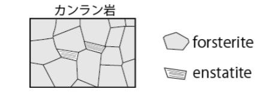

# 火山マグマ学予想問題・解答

---

### 質問1：　右表のような組成を持つ玄武岩質メルトが1473K，0.1 GPaで有する密度を求めよ．各酸化物の比体積およびモル質量については，配布資料11ページ目上（Table S5.1など）を参照すること．
 

---

### 質問２：　上記のメルトが0.1 GPa 条件下で1273 Kまで冷却し，10wt%のメルトがカンラン石（組成はMg 2 SiO 4 とする）として結晶化した場合について考える．この時にメルトが有する密度，およびマグマ（メルト＋カンラン石）が有する密度をそれぞれ求めよ．ただし，カンラン石（組成Mg 2 SiO 4 ）の密度は温度に依らず3300 kg/m 3 とする．

---

### 質問3：　質問2と同条件下で，カンラン石斑晶がメルト中を1 km落下するのに要する時間を求めよ．ただし，斑晶の半径は1 mmとし，メルトは対流しておらず粘性率200 Pa•secをもつと仮定する．

---

### 質問4：

下に，Mg 2 SiO 4 -SiO 2　 2成分系の20 kbar下における無水の場合（dry），及び水に過飽和な場合（wet）の相図を示す．図中破線は組成を読み易くするための補助線である．略語は以下の通り： Fo, forsterite; En, enstatite; Qz,quartz; L, liquid.　次の問いに答えよ．

![alt](data:image/png;base64,iVBORw0KGgoAAAANSUhEUgAAAOEAAADgCAMAAADCMfHtAAAAilBMVEX///8AAAD8/Pz19fX6+vrz8/Pg4ODw8PCAgIDJycnu7u7e3t7n5+fq6upKSkrNzc3T09O0tLQ1NTVfX1/Dw8NCQkJPT0+6uro/Pz/X19dHR0efn5+urq6VlZWPj49gYGB5eXlxcXF8fHyjo6NoaGiIiIgpKSktLS0YGBhXV1cfHx8WFhYrKysQEBDGM4VKAAAgAElEQVR4nO09h5qqPLAJIB0pUqVLUXB9/9e7mQR3bSDssnv+e78756wFETPMZHomCN2A0MgueTLSRiBPfNNIcDDONuj/CnixW8Yo6oOg1ZFxtu3WQJvQDrbavx7ZSrDZI6RuUS4ipHXIJ0/iDjWEqmr+r4e2FvBI613UwcseHeFpj2pg2B33T8e1Isgd4UcfXrUohCcf1fCUc6gqy7y8QmM3ZV3mu90uz3c1edzlNflj7wnAubu8IGcWzYE8lHKVFfGhbJrDIWvkMmvSTG7KA3mVxil506Rp02RplskZ/UxuyD/4T4G8ub4kUMj3UMhFWevzEGxSeKwNhPQadeRp06HMREgi2NaKZbqKq0SKaVlWZFmKaZqKGVnkwbQUyyEHFIWc8AXw2qWgKHFBXg7v2At2ipnhjpxoekngsrNteIJPAhve2zb5bx+2rhIEQUL+wVMS2EFg2/SZfNG2/WAWgtxRVQ0VaTtBcjQk+qqaW0j3VKEm3393jW76Yy19fTzCbI6X00SIiunLV+705wNwZUuAQ5bXW+St4rQmXNxzbPK0x3RGjsJ2+tpR8/KwhWv2ojYnv24W05dP59FwEjwrvEzd5zc0fI2hgovhVWlNf52c5/rb7TYM994+BPA98j7chvTGx9M3aBY4KirxBC+E01/XyhcHXfzJu7ky+XV9R7BoxCjSPuH68gJmSbUChh4hYILj0c+faXBnCfEvaBTg5PO1aUz+ukBuQPL543fnHnnyEE/foFmwBRbVsDz/G/s3nyfYXjSCpBpeWHeD+FDhs3mSZhJ8Ogmlsz8pb26hnf64wgulw0BDk6uJtcWr18MUw3h6Gs8Cn7EG5+OZyhU5k59WeClj2YAh3zmnHAX1KRULFAFVHeDSNeahf71pBzzTDt9NfVjhxWOqYNZuLVAs21wgvMqFcNcdkDTJCtpi+zm9UyzO+kY98VmwmIJsHloN8IYONrOZlRStECRauoKk2X8yPrn/s+b1hIb8DoIUQ1lBSYYyEFHuianYFjCsVsDQ/8KQ6LE5UrDG7fH8khfd5SyKGIbupccGwvA26tlhSsOZVtskhLdK6FaTjUNkRS/5WcHVq8PvoAJJo8GNpr7cdrhLVNKsIUsd9fad+b1BDt8dtxumwL79ybS9stEH0HANqy2U7t5a3xwmeBMjbsY7uMPQ+tRZIdUWa2h89f699U0qqviVhToHktc/yGTpWlxKnN5Pdoi+RUUe36lJtfbuhdaEOZG0uwGugQUKGJhrDW3hkN8u6kKWP622b6HoeLfv+KOr1UxoDce7cV27oWEBU3kE+GwVDMmt2jHsrjhqDxJVEN7arMX5LqZlU9+avnyP4RRkK2AYkqHVbkSYdIuvwcXoTi+WGOO7ySo8TZz4wRwq4fySiArXPQYBjer9Oww7Mg4Is3GJzWxgAOuWihRvzWYWIkx//TGyETxq+gamHWAoF5d6BxPquzRcQ+OT253DXa4NJH6KQ/PGgNs5Rwt1dUdv55aczvv3l9CfxK+boUpn/Dmce/heeD1bw8cn2NG7nEXE6P08rHxZmKVOCNcZZgLsiwnqgnd/ifbZfXbSZrhAxyZoYUob9em0t5Ct4FvsgUvBctOdgirZAZJPzqtd1+Y6zQQWlkpCCz5UxRvpv33h9HNp2R1vD8jk3nxDRmcrZFa2n2EXyb4TmdXVX3TLouRdMaIYB3RS9aevqXjAIyks/u6dJPHfSHXN5VKeTnO3ojderRjlFZva3PvH1AV3HVk1y1+0Z8cGvgNzJY0LLl1ZxDmxgfRzlu4JbkWehUAkR3o42fqMgMr31MkGrVncHhRneSPfhmym1ZYXCBk1E4KQ61BkpBwItcDQup17AsgC68uArp0bAhuDWXYXiOcvh+8NfSbMpCG/hWHUTbUPhjjSHmXAgQeCrXdDQypLrS+BirobIRIkqAH+Doi8sPojm6T79nfzc9lMNaoTPcd1aRPaQwzCYTpZJjyw1SLFDOh4K7lLeRTdYIjaLxJlVtRBADyqkRmKGtVzDZ4O+P4ABF3URbFYgKELAw9ZlF7wWah1R+ZZWBZNk1GVXRV+KiDtNhMhfTl9cuqIA1pbHi4Bps8K6moEFMcjMFeM0Tn4EaGAyHibDM1XEN8aKAZNvb1hM5pmEe8cWf0TRbUTbfYaZi4wrIpvyf0rMNe32ICqNb3zHpgxxT1QzGrbEpDzbzBUgbAiPmP8FU+7MW5ojpWBEAoQkrpXeb8A6TKNP+AiXJ/p43NuaSMY+p1xE12//6nm+TD6bmRtGVCbxibMt+u6DBX+rjR8v8vnTk8K4VthmF0nQyQjy1QsC+mgSfnvxmWWAGCo9Eh3FdPJ1S4yI05RLHdeYHeA8D2n5Wd2jtKDcYmdEO8I5+7GrLU1AbSFR1VWXCKrKw70N3evZiffELlI4CIl5AHYLXZCmI/bGQrNo5q/kUNT7wXRx4WDT+2i+/hdSEVky+DK8ESPB2FgH4n6Tl4KuIqcwXEo7mA6mkR7BBniCrAAZmTVhJYI4w67p0jAdd6XeQ3U3HW7nBah+N2Wgb+9ge7zAT7xffqm2/pd55dl7Xd1kdd1XndlfSjkUobXuVwWB1kuyrIrGLRgZYGRkgxRBzMdSWCKJ6rKdPqYQBjLlZn39S7fSUHCcklcDRwLva5FmmWKRB0rtBzFtCzyBI/WGMDn5nBS4LomRJ1M17Usl7yhFShkmpkB+R8EULEChSc2lJ0Ebg4iAIYIxiZIcmI1b14nTjiK2x6+YNQNMbe5C8ZA/nmZUQuDRE3Ld+nRtYFabZDIgGBLtY3Ms4gi//W5gLh6xZ6YAGmAOFDbPr5ccH889e3FcfDx0oZ+1x5pUcTe6fZ+53XwSG7Htu86748xTIEkNCMF74JwR2SrNCIAQLPTSFNEjFGxphkBsGG2hrTZSBue5+HvHjbEa1V1iddVkeclXdTE6E15zdqQRe/PucJRGOLnxiWNTxFSw7RyorlcegXuX3DpTAChxFNPSYgrWkFbUZ/fX2Z59YvO/jEswXAMumUO3v9CDHfLaPjXXLpgHo4B49Ji2+0fAi56mqbPwbwxGiZpNVK/5Mo/MNDXiCZSDCVsuspD0CfexXH6FMQ9vb6KcGnS4mURgHxMw+8mXdfhUipLJapE+YKaEMiilx2CjmZS3PrZY1zK8gGcEl8dDp2NTQSit9+OdaxCQ8Bwg+s6QbWtUJMgpcQI/EZWkYCb5LYIaoRLhWOaQoU8zuTBLA4Y4WJQUPK3gx1r0HBLuXSvuKJKzOsmQsHHqQVFGRd2JVC2vM3ujs1Dp2lEWl1NAzjEwvfOWyiZo5nEwz/FkHEp0A6iqY2GhChNTe6zLLBlNuEVji8vgjhWKKV6iKdsoJnNzobEYVQjkT9+WyKuIktB+0vUGKuThMY0EipV04rfGBJU8dy6kGM07CTDUJHhIH4IiwRDHDIMEjxVJzYNq9GQZXWlA6s715m8wX2LUzB5by3dMUnjgHvNCTYSBolqDN/adPh8fMwczIbVMByDJ3uHG9EW4F6PZfsF5H47ML4KhstsmpF5+Fvw93apMErD34G5uSfE03nmtrSo2714cGeCjwuYU8toyF+WjfCnkM6loQZKu6oNkwzQrQ0xtJC70/RQZFnu+SD8VzHcQTBnqC8AaSjuKHfq+WIa/nUUYyaGUrGDKpgStworFeGOPNWA3Wc1yEzg3iwwWRvmS5oObM8A8WeJBt04h1WMbKFaZuuF7dxUNe+9P2cdENM4zVJndpEAmJYQqSlNuvzArBEkNyziEXSmqUXaf29FsBRXBLzZGNJ8pmNXZBppoRuEEhIdxQ31aY2ffKPGZ12YLWkQdbP1gqZ3tboAK0rbwRoV5P/3yHcDq9g0/2kM47+32v4Y4tUiUb8EnBc6oec4e3/n7/3Oz7u8rsuyJpDvduWhOByK8kCey+JQ1PBRyR7gH5iTa2DYfduzmQNYCezEpokkN3HtQIF1zHYCh2z6yn4B5OMqsWkCdhUa/uo8xN//Kl0msbBS4SV0vzoPf4ChR9cfruE9/S6XDs+bT607m2UoDf+BB7wQGIbWEWPwYxB3uOD+Gngr2BwLRlaT0QVZ8zX+OPzBPJQulqqaQBM/NiTtagTnbPTBSNHKHga2io//+1zKlgAkMaqoTcWd2E0tyegJGYNKC1hmI7hSlxqjHpWla+Utfg1uJE2doD2bjQ0jYqkhg9jJ1Z6Wx0NlEq5heb5Y0YrHcC1J80cYRmH+WTXmsurHUudbQkN7qxKvTkNBznEKOV8OO5rmoBiuFhH+NRgwFMojpN4Gb9tlyzNks4WDAVDUldmKyp4IoCGMQEt7V8nM/FoNLADDkD8znAYaDtJTxkWBhuICvUZnOEZ82GuSjiZUmhVW5/2FPvSG3GnD4uB75taS6QiroWjDAbFk+YLTVzsTKmnSNbjUGGJUMtTTKkSqmceFbR8mgGJoXGNB+hGsaWVYe0ToExHJksDvpgkVrRwWIP1FYbtaxwEJ6TCOuIRw9q4iw4hEZ60lBhTDYJtARCKBxRlJIF/rbqGxS+2iGDdW8kHuAw4CTDAsB6RomHMVGkpoS8bh7qGWFlZjww8La5VcMBoS10iWi4YQ0Oz8z1VgsHxbdJFppk4BtNUb2dC/pt52rbXcRFvoPRIdKumULEYtXLldSYf8wPLev8eQTKaseVvxBPrwjJw6S4+1BBX99N71K9lyP8ZwikurHVRjHt+hCJKG0DBO7WNA1yyAwOOn+5fMhx9g6L+lIbt4+a6SF1arM4rB3HNLtDnarrPC4tSbQXwL6KK6SQyZabB7N1WBhoORj1jmVqzz1Qqcf+wBT3FpsBUNrRx0z6Dg6FpVpU5BdJkynaTeb3pPIsYtZnA6nvchLIPZenvH24Z7J9zC2/3eoxCSD509vN9uybFtSM3v6TiNu++dwT7Y9DQP2nXEfgj2btVxyO6C2CNHO2VR+eVSFCMAyyR/UWRq7C8yrUixTIUctCJ4D4+WYmmKS/7MwIwCK3KpRTrbt6ho2q+oYOUd2H/EFoQkEnQV2RH3u6vcfx6/fw2TnT+y/tMwEbotIVScITNGOtS7aDmkDpFGxG0X2DF4aMe80X6Tmt+DakKMGA7CXyn6HQ+dEpImFw2YmVYOy9kotl2VpllRuXFxwbivK3Gerr+ua9dZDII7tM26KxEJ8ypBsJ+UpcVN1T4RTEKapmWnUBlLuBSywnZGcE/TOE4pM6hRUB6JbChd/e1or9eOWDVQHRtZ8T1URsDe+l6+O09haFQ3TDc4LFBHFze8RrzNJNtEoAcf18wYSrzF+CIH0zL2ahKIdC2+AQj/xmrSKS69B5n5yiLQKu1pkWV6oc3oXq174iOYmmETjQ+a0TC4nPERR7AAJ7JXCKk8wc/607Dhn0fmnWSmRJXV7ggpmcsniJavihxyC+TW558MZgTSFfzDKcPVSDxA8lWm+VqRyVZ4C8C0P7BfRmFGnyj3nQHmTGtCwa0x3tlPoY69HFeZAel2NpKdUrzu1fozmLJLOToteNw50+I/fGu1ce4OKHl/GTNuDs3NV5PuVzoPTGFoMT4SkD6tx8M5sTZKydr8lbX3SVfv6l3TFAe5rOt909T1oezKJoVxT0kaaH3AEXj3A84GNS2+7Yyg3c67TVYx4nFJiHH2Cz0wClckhqvlEqNUsRI7cBU7iSvbol05proKaoNN/+4HHIlMRZ5H7FI0s3zLb07VfK7Y5NMed6uvbs5HtAwNVU/FS6NOUrnPddvjQKZpmGUo92ElrETt8cHVAo9YK+7PVmrsrBZqZPCig5QJ4nFPY95T83Bmz3xHQDgJVB/aiEYhdvQBQ93DXgfLt/H9kk1VxudVcaQ0pJSAPzcBC4l2aKVZ7gmWke5XAKQbaLzsgI1lhjQcWvghrEkkspRw8uYITTK4ABp+syW3goJNjQZsHmM2XIrXbNlSg7m1j5QYeQbq8k5GB9x8YjjbplFh3l5cIzsgvdX0LEXqXjLgGq2EQMzEuCCPPNjRLpm9cHvgAArw8QXFUuysFuigcZaj9CErB9R4SlOgioZUaaxtdo0wkiFDR2ilOiwv0nOiU9Cqr+Mbb0l6mdfYHPA3O7A9QQ2BCifzM8IruJFlg2V/mSkyPyKs0NYyhDwWEj4Cxce6UpsudNh96jE0E/QON6vQcReBYVJH2KTLT4JhwTltd7jELqVrmToaPd/IpdVRW03JhoUSD3DClyM+t5734YXH49FxPhzH2Tv70Am3e8dzQvI2DOHMUvlxIAskjXBR1RQQ3RI8q6Hh4tto4gOG5Gsl+ypPF3WLAu06ALeKewSB/kkcr9Llz6quqmTSGqqqip5h6LouijqAUgCSP0wt1Dff528UPK02ieezSUpuEYZtJXiEM/tDREqoBCd1Vl+MG+AeWl1zpkwcyeonOcgxje8ADZP5XKpp0CVJrksVqSltoaQc6NMb3+IBXlRB8wph9OL7sbp6JJFN/fM1+uovw5B7WfiulYRZv5txzwOJAJkHmw2ZBhJ5IkCO0IGt4gEvwlAYKe1XG4wn42LjcMD4crngM/mj0PfnCxF1+GOtvRHaZRiO9lTgkw/sf4+OVLpBH1hOgAfowUJe0o/ma/xxeO8B3w1majVCcMblypUda3BpuEgO8tN9MQKM01UD56vMw0UYcm86fwjyCScruskLuVRkU25o5CWwpzdhnAd4hyEMCl/W6680uwetQrwmYd9Ddy6uu1Dfx8YnasMtw3DOqiBth7u1tqxr5srSvISegUSLmlAiKGwV4uzyKIH0irNINozL0ltwHSyvU8wxt+pLgY7wUL3ZuWxxnscKdD0yjP0iyfDYJHkMYrxOXdVcfWiwQisxlAmTIurR04VBufZ2P6cH4N5scPUJfIbX2F1xtm9BNzqsHDJtOciqqYSGwJy5CruSAczdLWDMpnkBxhaXP9AcUr7rfB/PrfpSYYUl61sGXm+cQC4FGVDJttc3vDFfvs+lIYDyI1aF9mfKbq4sVaFmrT80ZYP0NpXBBSrltKXxg2WydFZ7t8+zt7j7mYc8fwcPwo5cECSQcDSGAk47pbp+2UrnNzbNE9j4Z01c1+jJvsx7mtei7wa4/M3ug9PQrFB9uYyG77ZDfAGEjN93ENaogvaWWW1LaUhA81914+Vr506Av7axmzV8C9rbRFeNJwucuGnSU8P2gYa0umn2b1R4/yStT0GU3XZ1eR2aXINLaXdPUImPvQQMOPi4YocbQvw4PJ6Lx0sFo1pVfyodp2suWIiGIVG8xnCNPUrggRU9G4PQYZJBPCCecrBxS0jGpZ+mjc6UATvDnujpVeLijh8o+7E2RqweeYSGK7gpNGh33ugSSgcFLTA6iTXPc1CUgm9Lbj63jYEl/BahMo0FskkUTGDIBbi/DRumVwwt+UJrYF/vqbrGLix0bwQctjvIHZJJySmK48J1I3wGjOXgs3oeYLDa8NYL6CakFvTnj2gbLBpgHgepvlWNkYwCEdZ6GHFPC/Jf7121SpwGMIQ5CGOtdSQUOfZhkgx7qGbRHasMhjrjUi2jG7fw+/4EQiN503lOvt0L1I/jYUcPKuvQoUiSZyzLNWQpYAh9dWDzQSYpGZ1EJukAwy9WEYZ5yJjVkpFGz2K9s9x39ruLt1+6KSvr8808rxoCT5y61j4zLAkadyETeGzeaecqS+UHDAfUOOyH+1DQ0qELP5OiSig38iSWqnfXQfp9iGgNbUHzFkyUaPcZBCWpqqebOuhDFbIzT9eCdejTQxLqZX3O11gz874n+x18w6a5hxRPrh43gzvC/qRv5hXCZV12f96Bx8bH8eyx3RbtLR+vYZdODdl8luAzffypDLgYvnKMaUCMJ6aHfvvhGhg64y7qYb/zH3l4Vo8h8+hMtbbliheTEVqSP9t9q3hPL44ZFGurID/5YDELc+YhTzh/eiPf9K7MDH4r20N6zg7IR7daVV5L4z8OgDJK/cI3ftyQ7Olq8JC8j86Y+H6FdRR70LPRTREv3tbvrELDJwz5MvRLiXodfvvwC5tJGkbJJeHpQvv03Wok1sb+Bkr6FvNIu72JYA1CFsKgql/KaN7HXNbd6VmWcnZZJOSoHCGjetw0blLSuOUFplPsEpq8C8px9f32EaxMPML4ciulyBhQ6CLTqcoDEnGc9TwqujRc4nK8YjtWlCR60OL54aM385BymEZ4day9/w00LzfiMe6dLI1uVAhLfmQFWjLEdgT3bknF9av9LVTmvie4feyt+i4zk9PxpZdZoVz7fetWWUO8nIggl6JmoxIa63T7oCW7Bk7ZNPxT1kaat/QyCmZFfyL8rqs/yNIkpRuhiQ10RxRZE4L4yY0BlCU5gxlqpDRQqmYpHcWcPUq+YLPW4lIGanuZFhogaaqYxqGTCtFyQRpJODx6xiIWyF+VYANJOLF7HRm4qmib7WUYrt1VkOvwWECL05WgOQGGKdrZhHv4oIS0rkBGbD3d6AJz0EoEmjMcImhuTeMkOkT3n6yWSViQmZkJxYtdowSzggVYAITdLBdxuyO2IPKKydSNzv1TueEmzXnWd6Jl0s7ju2v+dxlR5mVIF0F2rzUEM4V0mJNXkS4g+WpT0RnFCRtKj1eJpHLDVrkcEd3YaCvs4Al04T5JiKM713Tgf6G7Z/VliBt2R7DrKihX5HlVVcvZWbFiQ7dT5Xxq4QpHutSLstweVuc1cy/EL8muzQWbKUYjIcQ7XrsKOZfLqb9utayaVFqI9DPdeiU6iI1peYbUuUjvNkIZoCjcbGpQ7Mtc2mXZtbkQ4AKZBSFe8ujoMC51T/45IjaxF9aw4td/tWcgNIA3Txfa7KaltRgue7fQx994vC4aqrThN+qrvXc+9+C5e+IFXiBcJ3AcT8u6GECp1/DahP362HZxd4Wu6ECPnajJDyWyaQCGubhorniLMOTx8Ywv575ve3w8nfq2bcnr4/FIDsDDify1H+djf2rhw/OZvDvBJ/3H6eyEDsanHiqMvdBz+tMx7J3WOTo97MPkhMfzR+/0/QX3F/J4ueALZntkwnLfrat0gdWJNOJYLHGqlrHd6+rLifMfXhBhKCBeIuTkNxtJ2Gx4aSMRjoBMAnktSPxGUtWNSisxyQtGV/eyO4aBcXHOW7BUpxcLPcEyDDd/vN/ToC0MV2qsgwWlzgHQsFlS5rFwHv6GLJ0AmdHQRMEewfYncSYRbW8tGsWyIat/3O2a0dDsW0cnyi3sehVV5zJcVBu4zGr7cy5l7jCn0VFaEWhCcWEMdRmXSr+iD8dBXqPn3qKzx30LvS4P3Su/VC+zBxtEnC8n1sBw2Twc9y3cXWAnL4Zu4Dju71yBwgm3c8sj1sBwmW8x7uMrbCm3rlzXwAwqa2t9dmhjvSjMggWYZsHf03C8Jkq5lFA3ezgGQy/8QepCzGiob6Bh7eFxJqyB4bKwxPg8VGrT3NBWjjQjX3m4pXeDRsUAWy3/6MBNIhyae39Jw2XiXx2dhwOXZhGKaVDI9BQq1X0RRbQxCO/uwO9DhYKiuBy7zAPIK1TFL1Ph4x6wW2taJEJpQcaWyPVMmkSh6gyxGLZwKCKXSA4jV3mEv+fS8SiGcXTOly2K1Gsq+aqXo9YbUk0uE6kpdk5/KUuX6UPjWxr/Ie6qzk+3yCuswVmmLYx/Ynn/DObMw6+GGOqf7cLCYA0Ml23Cpf4vtEuXydI/59IV5uEyWfrn/uEKNFy2kZr6b/zDH8Gb/lXifYbgiUvfCP7Nm8Kud/1zZpvoDIZf45m7Nlz7DYbJff3HIw05PI1C+qbGK31T1FAsCTmp21MPHk19oamQ+OLRwffTd/GhKvbJLj1OrxhR3hRkroqhbyG13aAiJiLfQnbNC7T7+Rtt8VAV+6QP32weYb5pAFa9uQPzMzMEClvgiT0I3kzUoQ5CsJCOeiMcHzF8nIfdtDg333Bp9ebzRb5FAD0s2AJCqWXmKPT8/HjzrfshSA9dI9Bueh5GbzCw37TyaZbIUkdUJT+iNDNOzLUHA+XS99jpT7RfyQvAGPqYwKsQGpz02O+6fN95YeiH2/3Ox/u867rt3s93dZkXRZ3nHezntIPdm4pyeyEHyMGa/C/r4tAcGrkuCllumiZLm3TvpU2cNYWcHuSyaNJGjg9ZLMtZ1pRFlpV4EYaEYE2FIJqaxtQRD8APNURR1EUoiNVEAI290ERNYwfYwetraGwSkecoshRNszTRUqLAtExoRuYGrmIGdhCQZ5c8KgGD63NAjtoBlNkmsO1TklQJeUfOT8jRpIqrOE4hm5mRx7TKsriq5CVL39xzmbcC0nBadpAkjbPTr26L8A9Aq2iVi5gFoCD4LH2L4KA51V/ptfdfgPwMlZD6Cb8ol6DAhQ1UdOD6pcsuyNiH/SsuzstsHxd30KhK251WbgA3HwIy/FJBjoai/nXUoYP6vLOySV5aq3lqxDIKfF3rX8n8LNtEDqfjwPLmrkJeG2DlTG7BgmGaYEapLBMheCP+m4boHhrtLV+YjyKLp0H+VntVvwYLZnabzP1aLsZAd6mKFWiNAqeZv9qgWsEZszpoiWJLhHmafSmwhGpXumDhqYSRgN1dMN5Qm0l4tceuhX0vRzUIy+6LxryDt9D4j7aBQCbGb5fZckMhifbCPHJ3PdWotF2wXuP24VoxbEjkglFD1/s8mjN9Xe6wTD9KXvCZiQ0k9hQ54ZXhVARW4GhQqou6r+K2HO6VOxjLIqw+1fF0SpvHzAqpn8sh42McxPB1iGOKuBLd7Z0VqdNx0Sh3CF++ycOZ8H7jum4bGcBi3QvFTEtvjhvYe8F6FR4FcyPIYhsq9L+uzApHbTbvWXMyY7qYlA93cIOk8KliWqKsIw7OwpEa8f7t7Uq6JpMrZIdpmF2HBKCdiKXD7oXUI3TIg/qxkphC2lXdDmmtWb10sdLSVHqN713rtm9hfp0FbvW5F8x+0knkt9SyTGLa7zqujE/Br37O70C4ZsajW7OTT4iNYTAUNy0AAAPVSURBVIH1TAvPuBNMCgvITe6DR+8IB3ogqUdkYVDC0K16xEFIOkhT6Xl4Ozk2Di5toIkrswb5aJBz4xj6NBLTccRb5o61fK2jIsD6JhIIrWHx2XVx5WvwhmofFW5t82tKLKpKuIXBAYlXDInDN97Wh99DOkuvoQFjE8Pe1V/SN8PYh4F6JhrWxXFTO+g4w2z5ZQwRDHoDnqU6+K6lJeDiOJa9JzR0G5B1hGCUQHeRJ93MyYTyh3wR7IMx8btXSSPChGx+pfXzUGWJdgqsbbzuWIQ3mkwE/9g3ciDjbgPN+yiGPeHS6CY2QFRWZ10nIJ2OY/P6KvJFsGCy37FDJCY3LzptTcJSVDFdn3oci2eAzO5c2ENdp8hBBzq/72WoNmcX4xDkK9lmOkUAeuU1y3N4vyd+oKNo4DQ3v2RpJX2iJE46ZMb9lNcPH4R38mLU+gcMXShGJCory6A83thgujZFB7nIpeQGAYYuVNPGhP/kwh/xOjWFAk8FqP5b2yZa9XZH9/QBxcU1+JIR3JStIY6Jmo0PlhAZ/Q76CRFvnRBLNDq4QRG+tBjWmNGOSsmlPdcCqkrWFPa/Bebx2I7NQ8Td/KHAhdRs0LPKamLW3pBL0KCI+Oz4l/Mv9CX/K+AI4cjUE/mnhhdX4DfC7DKC/yCAqR4h/nK5nCciPC8jeM0Gls5xJZKdMCTTNSbcnThEwcJqssBU8YdzPA0apOlDooNNOY0PETK3dQ3GuXkwwaNqZPJckV/Qo8jvunK1zm4DGBFduc29b9X+hKGCqh5pOWo1zRLpti5FI5YpbQ5P1K24OWpX6eNEutXySZ1UwQbJiS4SUyPtq30MOygkBD3YjjCQeTs5BfZ/Zn8iq0F5yCvJNSvuG9R34BFs8k4baH91z4C1HJU7GIKQPeJDWHsq2NfeICFxGlwwl/84kzUNe2FfKcR899oePI1OFGO0MYm54Bc7umAi/9QfThxUJ94+FuD8Ned2h12Xhc6D/gAh5FBtkXsY8Rv/GZRKacgesCBNuPmikSLb8YmBlVoHINfXMntPLmMDJY2dQG+UQC0SRjwRBXVgbwBDJQUffrIb6p+DTZwcaE44+JO+Bj1qwK4HSwFoWH86gawx07DWubEgiEGbbBz5IRVFTtjGxfK6+N8FAxsIjI02CFziUBKVkjZ6ItOAUgoD/1q6zNraVo1uQJGUSfsHOTZvd8QlUkVNQkcdaeBDTzprfw+E5aCjA/Hb/U5HCSC2JXPJFaA6mXyufGJYscXuYX/CMTJ12FwLSVswn0xoh9yhRhqck0U9Mn4TVtZZ/w/z4H8Aj0t1PtSoy9AAAAAASUVORK5CYII=)

#### (a) 20 kbarは地球において深さ何kmに相当するか，10 kmの精度で答えよ．

#### (b) Enstatiteの化学式を記せ．

#### (c) X組成のカンラン岩が20 kbarにおいて融解し始める温度を，無水及び水に過飽和な場合についてそれぞれ答えよ．

#### (d) Forsteriteのみからなる岩石が無水20kbar下で融解する温度を答えよ．さらに，(c)との違いに着目し，下図のようなforsterite-enstatiteを含む無水カンラン岩が融解する際に，岩石中のどの部分から融け始めるか図中に示せ．

#### (e) 水に過飽和なX組成のカンラン岩の融解が， (c)からさらに進行した場合について考える．融解が進むにつれ，融け残り岩石の構成鉱物の割合はどう変化するか答えよ．

#### (f) (e)の部分融解がバッチ過程で進行し，ある時に融け残り岩石を構成する鉱物種が一つになった．この時の鉱物とメルトの重量比を答えよ．

$\boxed{鉱物：メルト　=}$

---

### 質問5：玄武岩は，深さ30 km及び75 kmで表１のような構成鉱物割合を示す．さらに，構成鉱物と花崗岩質メルト間の希土類元素La•Ybの分配係数が表2で示されている．以下の問いに答えよ．なお，解答はエクセルなどで提出しても良い．

* 表1：玄武岩中の鉱物割合 (wt%)

| 鉱物名 | 深さ 30 km | 深さ 75 km |
| :--- | :---: | :---: |
| 斜長石 | 40% | 0% |
| 斜方輝石 | 20% | 0% |
| 単斜輝石 | 25% | 43% |
| カリ長石 | 5% | 5% |
| 石英 | 5% | 15% |
| ざくろ石 | 0% | 35% |
| 磁鉄鉱 | 5% | 0% |
| ルチル | 0% | 2% |

* 表2：鉱物の希土類元素分配係数

| D(min/liq) | La | Yb |
| :--- | :---: | :---: |
| 斜長石 | 0.2 | 0.05 |
| 斜方輝石 | 0.01 | 0.4 |
| 単斜輝石 | 0.08 | 0.5 |
| カリ長石 | 0.02 | 0.005 |
| 石英 | 0.000 | 0.000 |
| ざくろ石 | 0.03 | 45 |
| 磁鉄鉱 | 0.006 | 0.008 |
| ルチル | 0.2 | 0.01 |

#### (a) 玄武岩の深さ30 km及び75 kmに置ける全岩分配係数をLa•Ybについて求めよ．

#### (b) 玄武岩が深さ30 km及び75 kmにおいて，バッチ融解で5%部分融解して形成された溶け残り岩石とメルトの[La/Yb] N を求めよ．ただし，N下付き括弧は部分融解前に岩石が持っていた比で規格化した値を表す．また，玄武岩の5%部分融解は，融解前の鉱物割合を保ったまま進行すると仮定する．

#### (c) 玄武岩が深さ30 km及び75 kmにおいて，最大分別融解で5%部分融解して形成された溶け残り岩石と集積メルトの[La/Yb] N を求めよ．ここでも，玄武岩の5%部分融解は，融解前の鉱物割合を保ったまま進行すると仮定する．

---

### 質問6：中央海嶺とホットスポットにおける玄武岩質マグマの生成過程の違いについて，次の点に着目しながら論ぜよ．
* **受動的/能動的 断熱上昇融解**
* **マントルの融解深度と部分融解度**
* **起源マントルの性質**

**なお，それぞれの項目について論じる際には，どのような観測事実に基づいて
得られた知見かについても記すこと（例えば，融解深度について論じる際には
，融解深度がどのようなデータから推定されているか，説明すること）．**

---

### 質問7：マントル岩石が深さ＞60kmおよび＜60kmで部分融解し、生成されたメルトのHREE濃度にどのような違いが見られると予想されるか。

---

### 質問8：典型的な中央海嶺玄武岩のREE濃度をコンドライト隕石のREE濃度で規格化したREEパターンが左下がりになる理由を答えよ。

---

### 質問9：出席問題の第3回を参照

